# Proteus library class diagrams

Source snapshot: `main` at `921b6e1`, reviewed 2026-10-25. Runtime sources are
unchanged from the [187-class reference](proteus-classes.md).

The overview shows the main objects and public boundaries. The 19 subsystem
views together cover **all 187 names** in `Proteus.Lib.dog` and its production
includes. A class may reappear as context in another view; repeated CodeDog
declaration blocks are merged into one class. Tests, theory, standalone programs
and generated classes are excluded. External CodeDog/native bases are labeled
and do not count toward the 187.

Each view has a scalable SVG preview and expandable Mermaid source. In the SVGs,
blue boxes belong to that subsystem, gray boxes provide context or external
types, yellow boxes are enums, and purple boxes are empty identity/marker types.
An empty box without edges can be a data-only record or a class whose
dependencies are outside that view. The diagram shows selected type references,
not every scalar field, method, local variable or call.

| Line | Meaning |
|---|---|
| Filled diamond at the source (`*--`) | `me` member or container element stored by value |
| Open diamond at the source (`o--`) | `our` shared owning reference; not exclusive UML ownership |
| Solid arrow (`-->`) | `their` borrowed reference |
| Dashed arrow (`..>`) | Method dependency, native wrapper or explicit weak reference, as labeled |
| Hollow triangle (`--|>`) | Declared inheritance |
| Dashed hollow triangle (`..|>`) | Declared `implements` interface |
| `*` / `[*]` at a target | Target appears in a collection; exact runtime cardinality is unspecified |

Edge labels use actual field names. `(+N)` means additional fields of the same
source/target type and storage qualifier were combined; it is not a cardinality.
Map key references as well as value references can contribute an edge. Ownership
qualifiers describe storage, not semantic identity: two references to equal
values do not establish the same contextual occurrence. `Agent` owns session
lifetimes; the `WorldManager` / `WorldPOVGraph` boundary owns reasoning and model
access. Word-rule planning structures remain a policy skeleton, as described in
the class reference.

## Views

- [Library overview](#00-overview)
- [Host, sessions and request handles](#01-host-sessions)
- [Infon model and list storage](#02-model-storage)
- [Occurrence provenance and identity tokens](#03-provenance)
- [Identity registry, repetition and end-relative access](#04-identity-registry)
- [Selection and temporal relationship records](#05-selection-time)
- [Vocabulary, lexical scopes and unit descriptions](#06-vocabulary)
- [Word-resolution policy records](#07-word-rules)
- [Parsing, formatting and stream workers](#08-streams-parser)
- [Frames, checked facts, parameters and publication](#09-frame-facts)
- [Logical sequences, walks and open alignment](#10-list-walks)
- [Correspondence and packed pattern matching](#11-correspondence)
- [Path evaluation, unit coordinates and sparse edits](#12-unit-paths)
- [Demands, cursors and retention](#13-demands)
- [Acquired values and cache evidence](#13-cache-evidence)
- [Generated occurrence addresses and durable writes](#14-generated)
- [Production programs, dependencies and replay](#15-production)
- [Layout proofs and private checked/produced views](#16-layout-views)
- [Shared text expressions and traversal](#18-shared-text)
- [Global services and native lifetime bindings](#17-global-native)

## Library overview

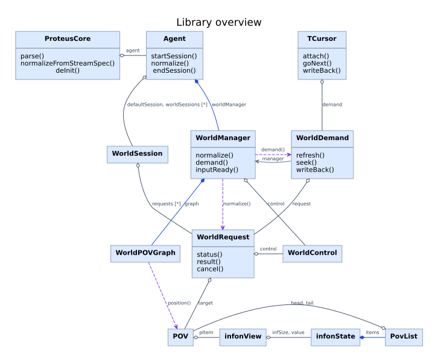

[Open scalable diagram](diagrams/proteus/00-overview.svg). Main architecture only.

Editable Mermaid source

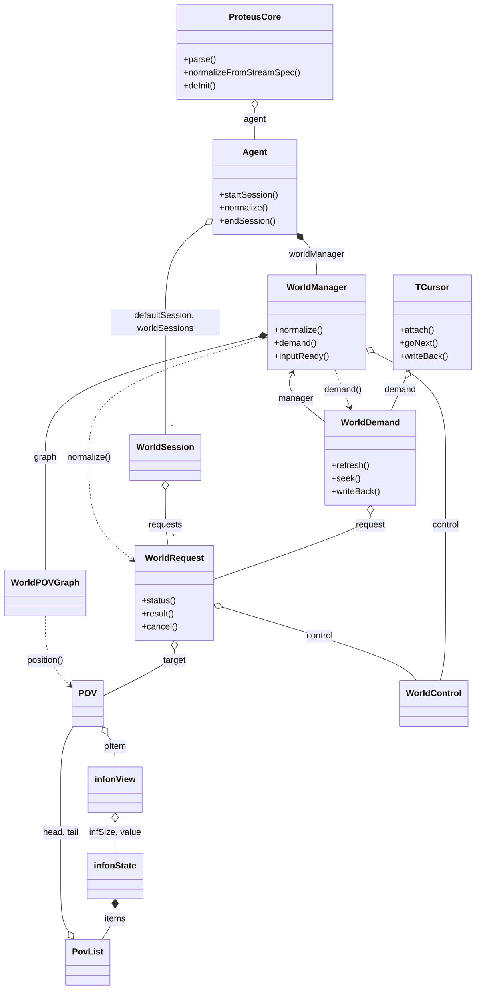
```mermaid
classDiagram
direction TB
class Agent {
    +startSession()
    +normalize()
    +endSession()
}
class POV {
}
class PovList {
}
class ProteusCore {
    +parse()
    +normalizeFromStreamSpec()
    +deInit()
}
class TCursor {
    +attach()
    +goNext()
    +writeBack()
}
class WorldControl {
}
class WorldDemand {
    +refresh()
    +seek()
    +writeBack()
}
class WorldManager {
    +normalize()
    +demand()
    +inputReady()
}
class WorldPOVGraph {
}
class WorldRequest {
    +status()
    +result()
    +cancel()
}
class WorldSession {
}
class infonState {
}
class infonView {
}
Agent *-- WorldManager : worldManager
Agent o-- "*" WorldSession : defaultSession, worldSessions
POV o-- infonView : pItem
PovList o-- POV : head, tail
ProteusCore o-- Agent : agent
TCursor o-- WorldDemand : demand
WorldDemand --> WorldManager : manager
WorldDemand o-- WorldRequest : request
WorldManager o-- WorldControl : control
WorldManager *-- WorldPOVGraph : graph
WorldRequest o-- POV : target
WorldRequest o-- WorldControl : control
WorldSession o-- "*" WorldRequest : requests
infonState *-- PovList : items
infonView o-- infonState : infSize, value
WorldManager ..> WorldRequest : normalize()
WorldManager ..> WorldDemand : demand()
WorldPOVGraph ..> POV : position()
```

## Host, sessions and request handles

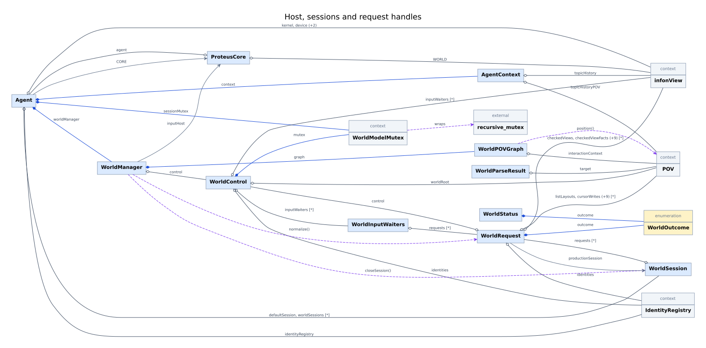

[Open scalable diagram](diagrams/proteus/01-host-sessions.svg). 12 primary classes.

Context: `POV`, `infonView`, `IdentityRegistry`, `WorldModelMutex`.

Editable Mermaid source

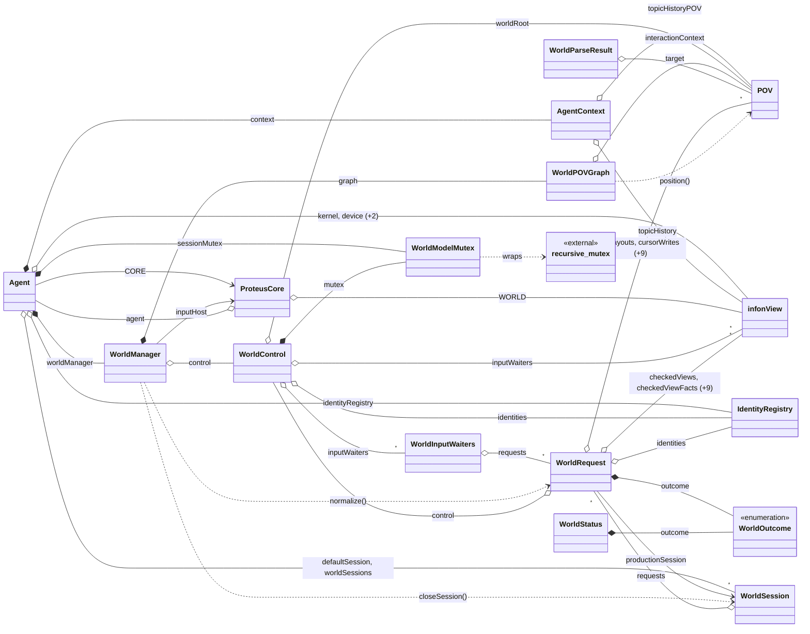
```mermaid
classDiagram
direction LR
class Agent {
}
class AgentContext {
}
class IdentityRegistry {
}
class POV {
}
class ProteusCore {
}
class WorldControl {
}
class WorldInputWaiters {
}
class WorldManager {
}
class WorldModelMutex {
}
class WorldOutcome {
    <<enumeration>>
}
class WorldPOVGraph {
}
class WorldParseResult {
}
class WorldRequest {
}
class WorldSession {
}
class WorldStatus {
}
class infonView {
}
class recursive_mutex {
    <<external>>
}
Agent *-- AgentContext : context
Agent o-- IdentityRegistry : identityRegistry
Agent --> ProteusCore : CORE
Agent *-- WorldManager : worldManager
Agent *-- WorldModelMutex : sessionMutex
Agent o-- "*" WorldSession : defaultSession, worldSessions
Agent o-- infonView : kernel, device (+2)
AgentContext o-- POV : topicHistoryPOV
AgentContext o-- infonView : topicHistory
ProteusCore o-- Agent : agent
ProteusCore o-- infonView : WORLD
WorldControl o-- IdentityRegistry : identities
WorldControl o-- POV : worldRoot
WorldControl o-- "*" WorldInputWaiters : inputWaiters
WorldControl *-- WorldModelMutex : mutex
WorldControl o-- "*" infonView : inputWaiters
WorldInputWaiters o-- "*" WorldRequest : requests
WorldManager --> ProteusCore : inputHost
WorldManager o-- WorldControl : control
WorldManager *-- WorldPOVGraph : graph
WorldPOVGraph o-- POV : interactionContext
WorldParseResult o-- POV : target
WorldRequest o-- IdentityRegistry : identities
WorldRequest o-- "*" POV : listLayouts, cursorWrites (+9)
WorldRequest o-- WorldControl : control
WorldRequest *-- WorldOutcome : outcome
WorldRequest --> WorldSession : productionSession
WorldRequest o-- "*" infonView : checkedViews, checkedViewFacts (+9)
WorldSession o-- "*" WorldRequest : requests
WorldStatus *-- WorldOutcome : outcome
WorldManager ..> WorldRequest : normalize()
WorldManager ..> WorldSession : closeSession()
WorldPOVGraph ..> POV : position()
WorldModelMutex ..> recursive_mutex : wraps
```

## Infon model and list storage

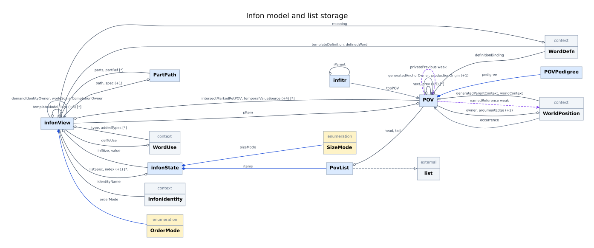

[Open scalable diagram](diagrams/proteus/02-model-storage.svg). 9 primary classes.

Context: `WordUse`, `WordDefn`, `WorldPosition`, `InfonIdentity`.

Editable Mermaid source

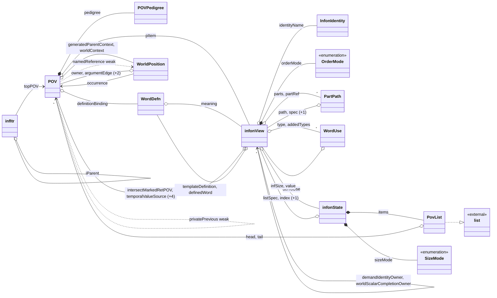
```mermaid
classDiagram
direction LR
class InfonIdentity {
}
class OrderMode {
    <<enumeration>>
}
class POV {
}
class POVPedigree {
}
class PartPath {
}
class PovList {
}
class SizeMode {
    <<enumeration>>
}
class WordDefn {
}
class WordUse {
}
class WorldPosition {
}
class infItr {
}
class infonState {
}
class infonView {
}
class list {
    <<external>>
}
POV o-- "*" POV : next, prev (+5)
POV --> POV : generatedAnchorOwner, productionOrigin (+1)
POV ..> POV : privatePrevious weak
POV *-- POVPedigree : pedigree
POV o-- WordDefn : definitionBinding
POV o-- WorldPosition : generatedParentContext, worldContext
POV ..> WorldPosition : namedReference weak
POV o-- infonView : pItem
PartPath o-- infonView : path, spec (+1)
PovList o-- POV : head, tail
WordDefn o-- infonView : meaning
WordUse o-- infonView : defToUse
WorldPosition o-- POV : owner, argumentEdge (+2)
WorldPosition --> POV : occurrence
infItr --> POV : topPOV
infItr o-- infItr : iParent
infonState *-- PovList : items
infonState *-- SizeMode : sizeMode
infonState o-- "*" infonView : listSpec, index (+1)
infonView o-- InfonIdentity : identityName
infonView *-- OrderMode : orderMode
infonView o-- "*" POV : intersectMarkedRetPOV, temporalValueSource (+4)
infonView o-- "*" PartPath : parts, partRef
infonView o-- WordDefn : templateDefinition, definedWord
infonView o-- "*" WordUse : type, addedTypes
infonView o-- infonState : infSize, value
infonView o-- "*" infonView : templateModel, innr (+6)
infonView --> infonView : demandIdentityOwner, worldScalarCompletionOwner
PovList ..|> list
```

## Occurrence provenance and identity tokens

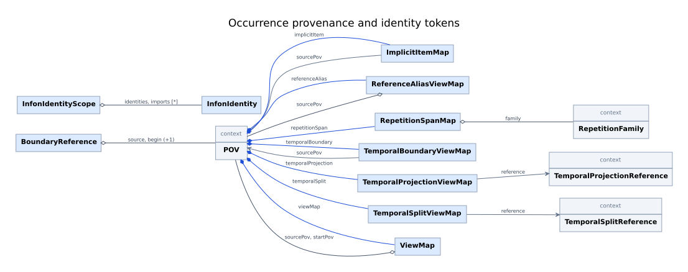

[Open scalable diagram](diagrams/proteus/03-provenance.svg). 10 primary classes.

Context: `POV`, `RepetitionFamily`, `TemporalProjectionReference`, `TemporalSplitReference`.

Editable Mermaid source

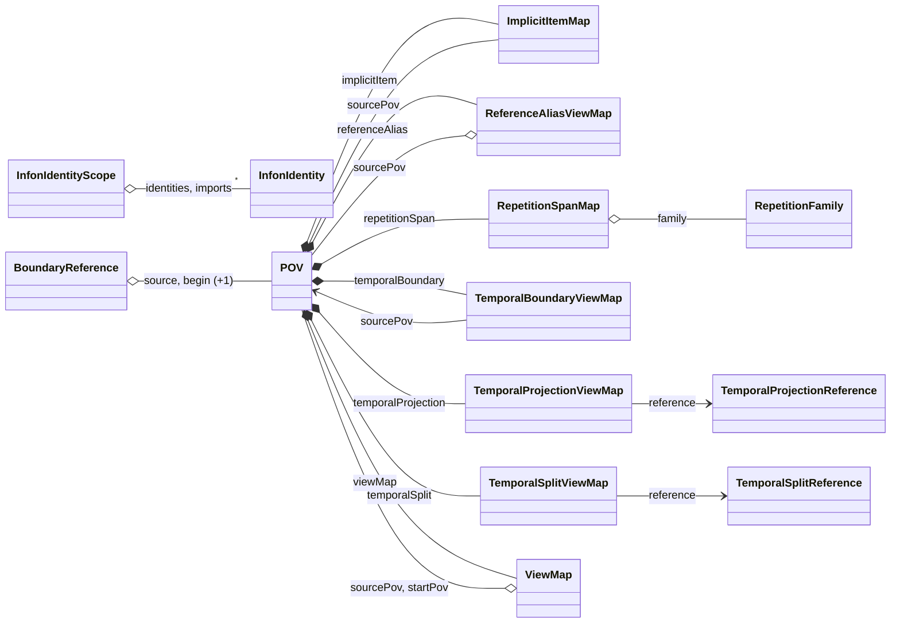
```mermaid
classDiagram
direction LR
class BoundaryReference {
}
class ImplicitItemMap {
}
class InfonIdentity {
}
class InfonIdentityScope {
}
class POV {
}
class ReferenceAliasViewMap {
}
class RepetitionFamily {
}
class RepetitionSpanMap {
}
class TemporalBoundaryViewMap {
}
class TemporalProjectionReference {
}
class TemporalProjectionViewMap {
}
class TemporalSplitReference {
}
class TemporalSplitViewMap {
}
class ViewMap {
}
BoundaryReference o-- POV : source, begin (+1)
ImplicitItemMap --> POV : sourcePov
InfonIdentityScope o-- "*" InfonIdentity : identities, imports
POV *-- ImplicitItemMap : implicitItem
POV *-- ReferenceAliasViewMap : referenceAlias
POV *-- RepetitionSpanMap : repetitionSpan
POV *-- TemporalBoundaryViewMap : temporalBoundary
POV *-- TemporalProjectionViewMap : temporalProjection
POV *-- TemporalSplitViewMap : temporalSplit
POV *-- ViewMap : viewMap
ReferenceAliasViewMap o-- POV : sourcePov
RepetitionSpanMap o-- RepetitionFamily : family
TemporalBoundaryViewMap --> POV : sourcePov
TemporalProjectionViewMap --> TemporalProjectionReference : reference
TemporalSplitViewMap --> TemporalSplitReference : reference
ViewMap o-- POV : sourcePov, startPov
```

## Identity registry, repetition and end-relative access

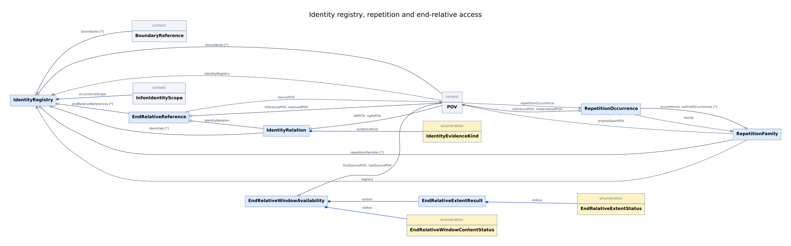

[Open scalable diagram](diagrams/proteus/04-identity-registry.svg). 10 primary classes.

Context: `POV`, `InfonIdentityScope`, `BoundaryReference`.

Editable Mermaid source

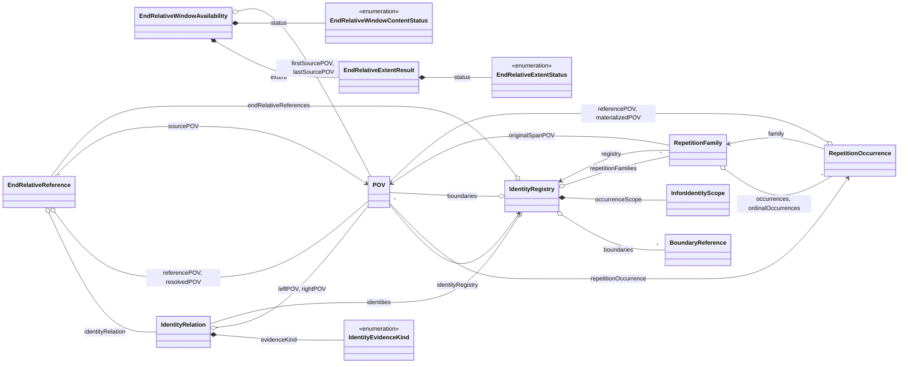
```mermaid
classDiagram
direction LR
class BoundaryReference {
}
class EndRelativeExtentResult {
}
class EndRelativeExtentStatus {
    <<enumeration>>
}
class EndRelativeReference {
}
class EndRelativeWindowAvailability {
}
class EndRelativeWindowContentStatus {
    <<enumeration>>
}
class IdentityEvidenceKind {
    <<enumeration>>
}
class IdentityRegistry {
}
class IdentityRelation {
}
class InfonIdentityScope {
}
class POV {
}
class RepetitionFamily {
}
class RepetitionOccurrence {
}
EndRelativeExtentResult *-- EndRelativeExtentStatus : status
EndRelativeReference o-- IdentityRelation : identityRelation
EndRelativeReference o-- POV : referencePOV, resolvedPOV
EndRelativeReference --> POV : sourcePOV
EndRelativeWindowAvailability *-- EndRelativeExtentResult : extent
EndRelativeWindowAvailability *-- EndRelativeWindowContentStatus : status
EndRelativeWindowAvailability o-- POV : firstSourcePOV, lastSourcePOV
IdentityRegistry o-- "*" BoundaryReference : boundaries
IdentityRegistry o-- "*" EndRelativeReference : endRelativeReferences
IdentityRegistry o-- "*" IdentityRelation : identities
IdentityRegistry *-- InfonIdentityScope : occurrenceScope
IdentityRegistry o-- "*" POV : boundaries
IdentityRegistry o-- "*" RepetitionFamily : repetitionFamilies
IdentityRelation *-- IdentityEvidenceKind : evidenceKind
IdentityRelation o-- POV : leftPOV, rightPOV
POV --> IdentityRegistry : identityRegistry
POV --> RepetitionOccurrence : repetitionOccurrence
RepetitionFamily --> IdentityRegistry : registry
RepetitionFamily --> POV : originalSpanPOV
RepetitionFamily o-- "*" RepetitionOccurrence : occurrences, ordinalOccurrences
RepetitionOccurrence o-- POV : referencePOV, materializedPOV
RepetitionOccurrence --> RepetitionFamily : family
```

## Selection and temporal relationship records

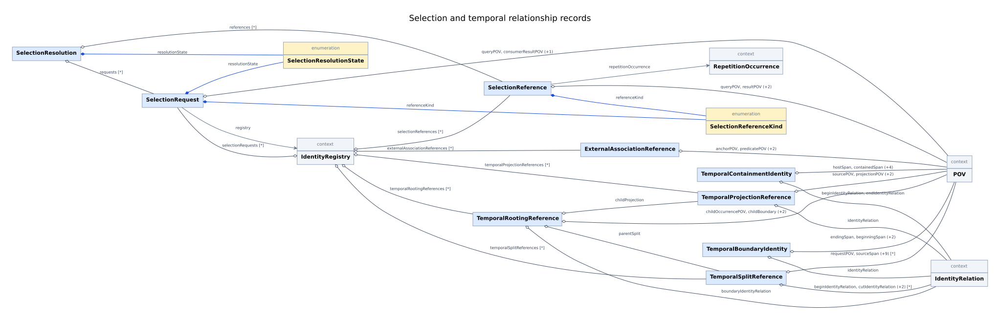

[Open scalable diagram](diagrams/proteus/05-selection-time.svg). 11 primary classes.

Context: `IdentityRegistry`, `IdentityRelation`, `POV`, `RepetitionOccurrence`.

Editable Mermaid source

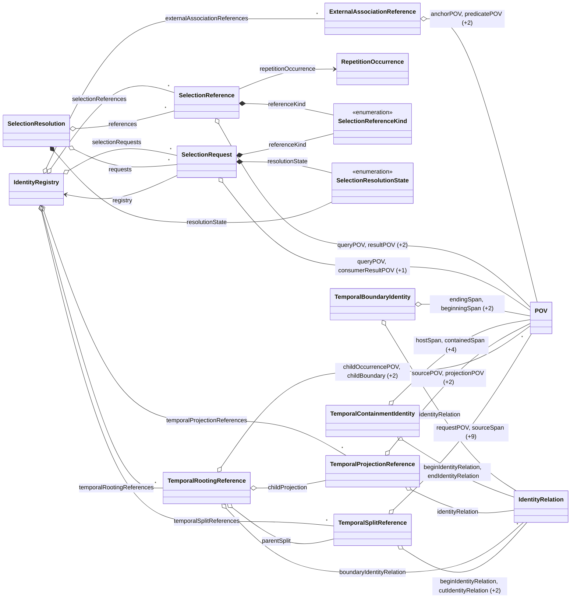
```mermaid
classDiagram
direction LR
class ExternalAssociationReference {
}
class IdentityRegistry {
}
class IdentityRelation {
}
class POV {
}
class RepetitionOccurrence {
}
class SelectionReference {
}
class SelectionReferenceKind {
    <<enumeration>>
}
class SelectionRequest {
}
class SelectionResolution {
}
class SelectionResolutionState {
    <<enumeration>>
}
class TemporalBoundaryIdentity {
}
class TemporalContainmentIdentity {
}
class TemporalProjectionReference {
}
class TemporalRootingReference {
}
class TemporalSplitReference {
}
ExternalAssociationReference o-- POV : anchorPOV, predicatePOV (+2)
IdentityRegistry o-- "*" ExternalAssociationReference : externalAssociationReferences
IdentityRegistry o-- "*" SelectionReference : selectionReferences
IdentityRegistry o-- "*" SelectionRequest : selectionRequests
IdentityRegistry o-- "*" TemporalProjectionReference : temporalProjectionReferences
IdentityRegistry o-- "*" TemporalRootingReference : temporalRootingReferences
IdentityRegistry o-- "*" TemporalSplitReference : temporalSplitReferences
SelectionReference o-- POV : queryPOV, resultPOV (+2)
SelectionReference --> RepetitionOccurrence : repetitionOccurrence
SelectionReference *-- SelectionReferenceKind : referenceKind
SelectionRequest --> IdentityRegistry : registry
SelectionRequest o-- POV : queryPOV, consumerResultPOV (+1)
SelectionRequest *-- SelectionReferenceKind : referenceKind
SelectionRequest *-- SelectionResolutionState : resolutionState
SelectionResolution o-- "*" SelectionReference : references
SelectionResolution o-- "*" SelectionRequest : requests
SelectionResolution *-- SelectionResolutionState : resolutionState
TemporalBoundaryIdentity o-- IdentityRelation : identityRelation
TemporalBoundaryIdentity o-- POV : endingSpan, beginningSpan (+2)
TemporalContainmentIdentity o-- IdentityRelation : beginIdentityRelation, endIdentityRelation
TemporalContainmentIdentity o-- POV : hostSpan, containedSpan (+4)
TemporalProjectionReference o-- IdentityRelation : identityRelation
TemporalProjectionReference o-- POV : sourcePOV, projectionPOV (+2)
TemporalRootingReference o-- IdentityRelation : boundaryIdentityRelation
TemporalRootingReference o-- POV : childOccurrencePOV, childBoundary (+2)
TemporalRootingReference o-- TemporalProjectionReference : childProjection
TemporalRootingReference o-- TemporalSplitReference : parentSplit
TemporalSplitReference o-- "*" IdentityRelation : beginIdentityRelation, cutIdentityRelation (+2)
TemporalSplitReference o-- "*" POV : requestPOV, sourceSpan (+9)
```

## Vocabulary, lexical scopes and unit descriptions

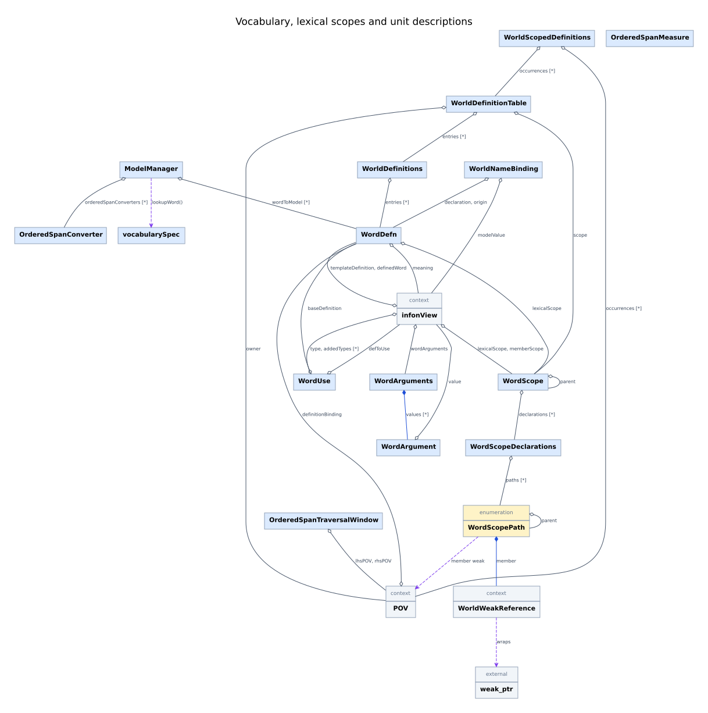

[Open scalable diagram](diagrams/proteus/06-vocabulary.svg). 16 primary classes.

Context: `infonView`, `POV`, `WorldWeakReference`.

Editable Mermaid source

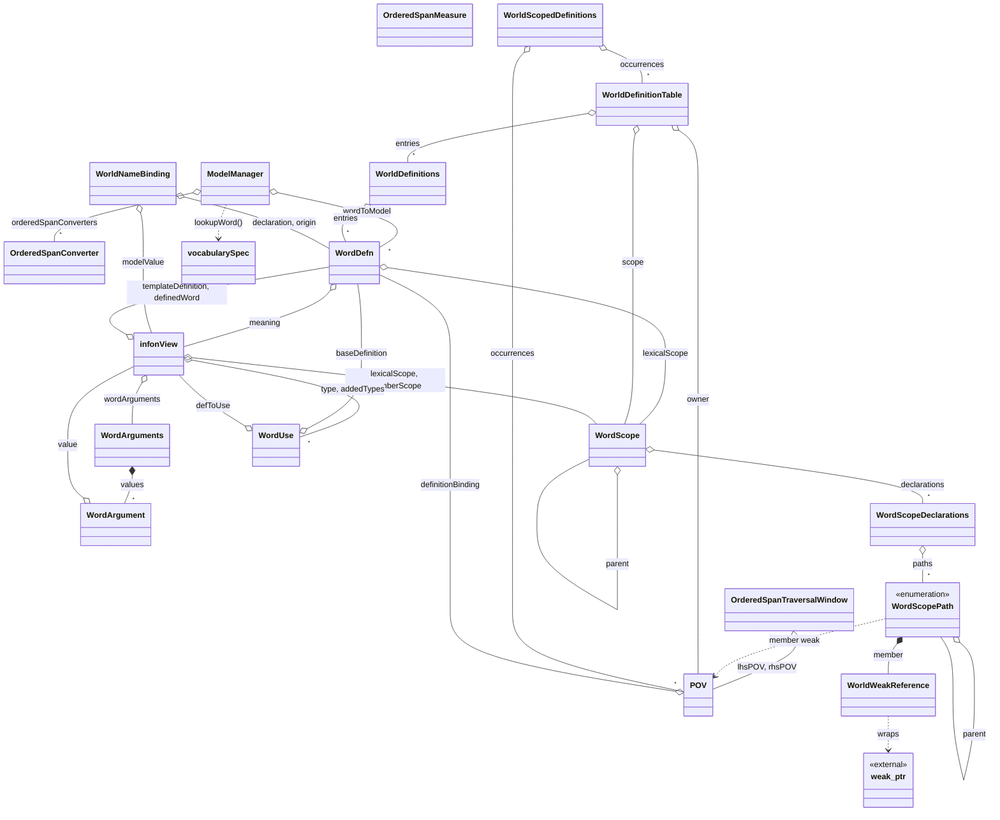
```mermaid
classDiagram
direction TB
class ModelManager {
}
class OrderedSpanConverter {
}
class OrderedSpanMeasure {
}
class OrderedSpanTraversalWindow {
}
class POV {
}
class WordArgument {
}
class WordArguments {
}
class WordDefn {
}
class WordScope {
}
class WordScopeDeclarations {
}
class WordScopePath {
    <<enumeration>>
}
class WordUse {
}
class WorldDefinitionTable {
}
class WorldDefinitions {
}
class WorldNameBinding {
}
class WorldScopedDefinitions {
}
class WorldWeakReference {
}
class infonView {
}
class vocabularySpec {
}
class weak_ptr {
    <<external>>
}
ModelManager o-- "*" OrderedSpanConverter : orderedSpanConverters
ModelManager o-- "*" WordDefn : wordToModel
OrderedSpanTraversalWindow o-- POV : lhsPOV, rhsPOV
POV o-- WordDefn : definitionBinding
WordArgument o-- infonView : value
WordArguments *-- "*" WordArgument : values
WordDefn o-- WordScope : lexicalScope
WordDefn o-- infonView : meaning
WordScope o-- WordScope : parent
WordScope o-- "*" WordScopeDeclarations : declarations
WordScopeDeclarations o-- "*" WordScopePath : paths
WordScopePath ..> POV : member weak
WordScopePath o-- WordScopePath : parent
WordScopePath *-- WorldWeakReference : member
WordUse o-- WordDefn : baseDefinition
WordUse o-- infonView : defToUse
WorldDefinitionTable o-- POV : owner
WorldDefinitionTable o-- WordScope : scope
WorldDefinitionTable o-- "*" WorldDefinitions : entries
WorldDefinitions o-- "*" WordDefn : entries
WorldNameBinding o-- WordDefn : declaration, origin
WorldNameBinding o-- infonView : modelValue
WorldScopedDefinitions o-- "*" POV : occurrences
WorldScopedDefinitions o-- "*" WorldDefinitionTable : occurrences
infonView o-- WordArguments : wordArguments
infonView o-- WordDefn : templateDefinition, definedWord
infonView o-- WordScope : lexicalScope, memberScope
infonView o-- "*" WordUse : type, addedTypes
ModelManager ..> vocabularySpec : lookupWord()
WorldWeakReference ..> weak_ptr : wraps
```

## Word-resolution policy records

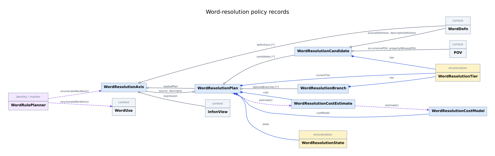

[Open scalable diagram](diagrams/proteus/07-word-rules.svg). 9 primary classes.

Context: `WordDefn`, `WordUse`, `POV`, `infonView`.

Editable Mermaid source

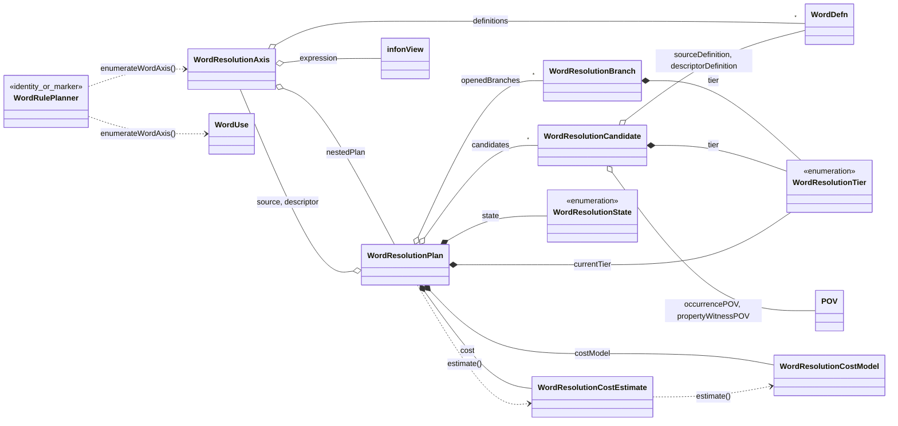
```mermaid
classDiagram
direction LR
class POV {
}
class WordDefn {
}
class WordResolutionAxis {
}
class WordResolutionBranch {
}
class WordResolutionCandidate {
}
class WordResolutionCostEstimate {
}
class WordResolutionCostModel {
}
class WordResolutionPlan {
}
class WordResolutionState {
    <<enumeration>>
}
class WordResolutionTier {
    <<enumeration>>
}
class WordRulePlanner {
    <<identity_or_marker>>
}
class WordUse {
}
class infonView {
}
WordResolutionAxis o-- "*" WordDefn : definitions
WordResolutionAxis o-- WordResolutionPlan : nestedPlan
WordResolutionAxis o-- infonView : expression
WordResolutionBranch *-- WordResolutionTier : tier
WordResolutionCandidate o-- POV : occurrencePOV, propertyWitnessPOV
WordResolutionCandidate o-- WordDefn : sourceDefinition, descriptorDefinition
WordResolutionCandidate *-- WordResolutionTier : tier
WordResolutionPlan o-- WordResolutionAxis : source, descriptor
WordResolutionPlan o-- "*" WordResolutionBranch : openedBranches
WordResolutionPlan o-- "*" WordResolutionCandidate : candidates
WordResolutionPlan *-- WordResolutionCostEstimate : cost
WordResolutionPlan *-- WordResolutionCostModel : costModel
WordResolutionPlan *-- WordResolutionState : state
WordResolutionPlan *-- WordResolutionTier : currentTier
WordResolutionPlan ..> WordResolutionCostEstimate : estimate()
WordRulePlanner ..> WordResolutionAxis : enumerateWordAxis()
WordRulePlanner ..> WordUse : enumerateWordAxis()
WordResolutionCostEstimate ..> WordResolutionCostModel : estimate()
```

## Parsing, formatting and stream workers

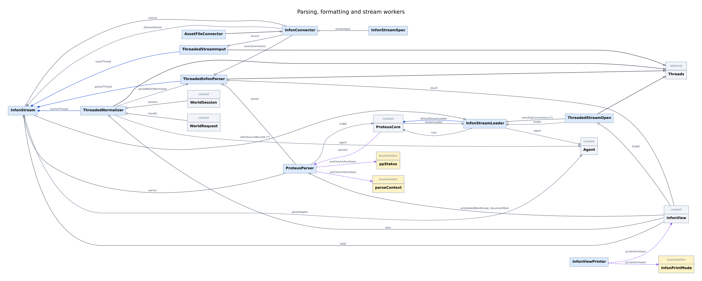

[Open scalable diagram](diagrams/proteus/08-streams-parser.svg). 14 primary classes.

Context: `ProteusCore`, `Agent`, `WorldRequest`, `WorldSession`, `infonView`.

Editable Mermaid source

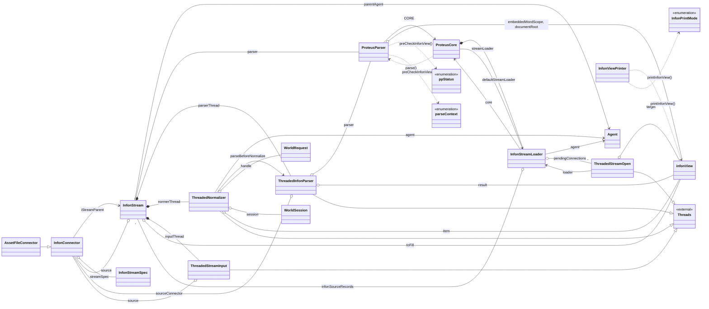
```mermaid
classDiagram
direction LR
class Agent {
}
class AssetFileConnector {
}
class InfonConnector {
}
class InfonPrintMode {
    <<enumeration>>
}
class InfonStream {
}
class InfonStreamLoader {
}
class InfonStreamSpec {
}
class InfonViewPrinter {
}
class ProteusCore {
}
class ProteusParser {
}
class ThreadedInfonParser {
}
class ThreadedNormalizer {
}
class ThreadedStreamInput {
}
class ThreadedStreamOpen {
}
class WorldRequest {
}
class WorldSession {
}
class infonView {
}
class parseContext {
    <<enumeration>>
}
class ppStatus {
    <<enumeration>>
}
class Threads {
    <<external>>
}
InfonConnector --> InfonStream : iStreamParent
InfonConnector o-- InfonStreamSpec : streamSpec
InfonStream --> Agent : parentAgent
InfonStream o-- InfonConnector : source
InfonStream o-- ProteusParser : parser
InfonStream *-- ThreadedInfonParser : parserThread
InfonStream *-- ThreadedNormalizer : normerThread
InfonStream *-- ThreadedStreamInput : inputThread
InfonStream o-- infonView : toFill
InfonStreamLoader --> Agent : agent
InfonStreamLoader o-- "*" InfonStream : infonSourceRecords
InfonStreamLoader --> ProteusCore : core
InfonStreamLoader o-- "*" ThreadedStreamOpen : pendingConnections
ProteusCore *-- InfonStreamLoader : defaultStreamLoader
ProteusCore --> InfonStreamLoader : streamLoader
ProteusParser --> ProteusCore : CORE
ProteusParser o-- infonView : embeddedWordScope, documentRoot
ThreadedInfonParser o-- InfonConnector : sourceConnector
ThreadedInfonParser o-- ProteusParser : parser
ThreadedInfonParser o-- infonView : result
ThreadedNormalizer --> Agent : agent
ThreadedNormalizer --> ThreadedInfonParser : parseBeforeNormalize
ThreadedNormalizer o-- WorldRequest : handle
ThreadedNormalizer o-- WorldSession : session
ThreadedNormalizer o-- infonView : item
ThreadedStreamInput o-- InfonConnector : source
ThreadedStreamOpen --> InfonStreamLoader : loader
ThreadedStreamOpen o-- infonView : target
ProteusCore ..> ProteusParser : parse()
InfonViewPrinter ..> infonView : printInfonView()
ProteusParser ..> ppStatus : preCheckInfonView()
ProteusParser ..> parseContext : preCheckInfonView()
InfonViewPrinter ..> InfonPrintMode : printInfonView()
AssetFileConnector --|> InfonConnector
ThreadedInfonParser --|> Threads
ThreadedNormalizer --|> Threads
ThreadedStreamInput --|> Threads
ThreadedStreamOpen --|> Threads
```

## Frames, checked facts, parameters and publication

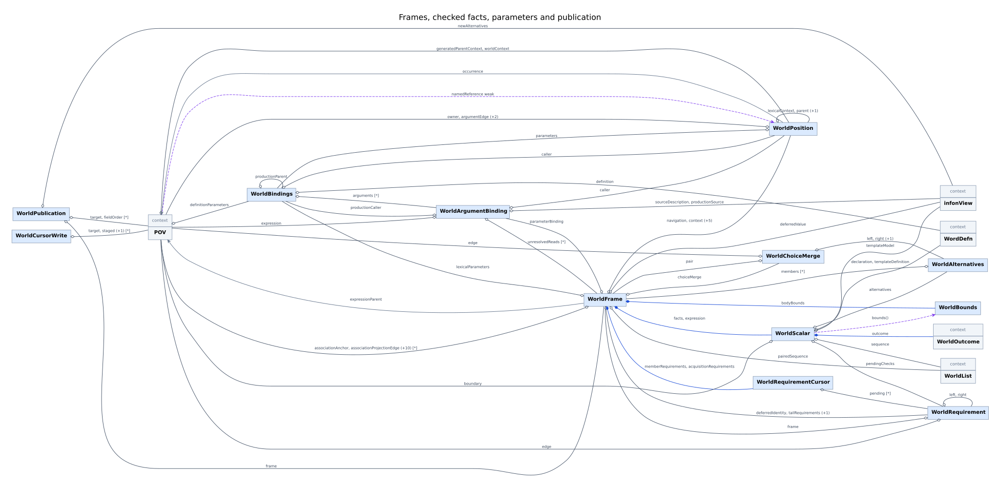

[Open scalable diagram](diagrams/proteus/09-frame-facts.svg). 12 primary classes.

Context: `POV`, `infonView`, `WordDefn`, `WorldList`, `WorldOutcome`.

Editable Mermaid source

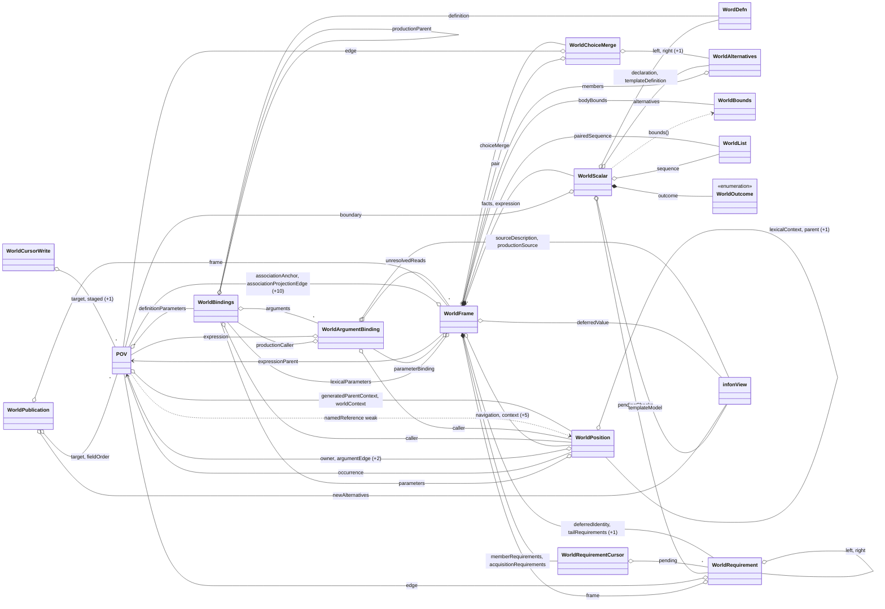
```mermaid
classDiagram
direction LR
class POV {
}
class WordDefn {
}
class WorldAlternatives {
}
class WorldArgumentBinding {
}
class WorldBindings {
}
class WorldBounds {
}
class WorldChoiceMerge {
}
class WorldCursorWrite {
}
class WorldFrame {
}
class WorldList {
}
class WorldOutcome {
    <<enumeration>>
}
class WorldPosition {
}
class WorldPublication {
}
class WorldRequirement {
}
class WorldRequirementCursor {
}
class WorldScalar {
}
class infonView {
}
POV o-- WorldBindings : definitionParameters
POV o-- WorldPosition : generatedParentContext, worldContext
POV ..> WorldPosition : namedReference weak
WorldAlternatives o-- "*" WorldFrame : members
WorldArgumentBinding o-- POV : expression
WorldArgumentBinding o-- WorldBindings : productionCaller
WorldArgumentBinding o-- "*" WorldFrame : unresolvedReads
WorldArgumentBinding o-- WorldPosition : caller
WorldArgumentBinding o-- infonView : sourceDescription, productionSource
WorldBindings o-- WordDefn : definition
WorldBindings o-- "*" WorldArgumentBinding : arguments
WorldBindings o-- WorldBindings : productionParent
WorldBindings o-- WorldPosition : caller
WorldChoiceMerge o-- POV : edge
WorldChoiceMerge o-- WorldAlternatives : left, right (+1)
WorldChoiceMerge o-- WorldFrame : pair
WorldCursorWrite o-- "*" POV : target, staged (+1)
WorldFrame o-- "*" POV : associationAnchor, associationProjectionEdge (+10)
WorldFrame --> POV : expressionParent
WorldFrame o-- WorldArgumentBinding : parameterBinding
WorldFrame o-- WorldBindings : lexicalParameters
WorldFrame *-- WorldBounds : bodyBounds
WorldFrame o-- WorldChoiceMerge : choiceMerge
WorldFrame o-- WorldList : pairedSequence
WorldFrame o-- WorldPosition : navigation, context (+5)
WorldFrame o-- WorldRequirement : deferredIdentity, tailRequirements (+1)
WorldFrame *-- WorldRequirementCursor : memberRequirements, acquisitionRequirements
WorldFrame *-- WorldScalar : facts, expression
WorldFrame o-- infonView : deferredValue
WorldPosition o-- POV : owner, argumentEdge (+2)
WorldPosition --> POV : occurrence
WorldPosition o-- WorldBindings : parameters
WorldPosition o-- WorldPosition : lexicalContext, parent (+1)
WorldPublication o-- "*" POV : target, fieldOrder
WorldPublication o-- WorldFrame : frame
WorldPublication o-- infonView : newAlternatives
WorldRequirement o-- POV : edge
WorldRequirement o-- WorldFrame : frame
WorldRequirement o-- WorldRequirement : left, right
WorldRequirementCursor o-- "*" WorldRequirement : pending
WorldScalar o-- POV : boundary
WorldScalar o-- WordDefn : declaration, templateDefinition
WorldScalar o-- WorldAlternatives : alternatives
WorldScalar o-- WorldList : sequence
WorldScalar *-- WorldOutcome : outcome
WorldScalar o-- WorldRequirement : pendingChecks
WorldScalar o-- infonView : templateModel
WorldScalar ..> WorldBounds : bounds()
```

## Logical sequences, walks and open alignment

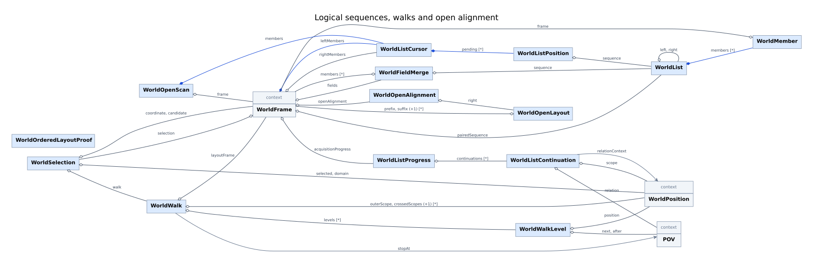

[Open scalable diagram](diagrams/proteus/10-list-walks.svg). 14 primary classes.

Context: `WorldFrame`, `WorldPosition`, `POV`.

Editable Mermaid source

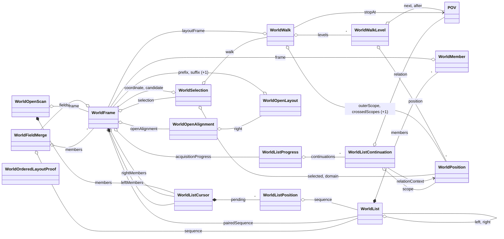
```mermaid
classDiagram
direction LR
class POV {
}
class WorldFieldMerge {
}
class WorldFrame {
}
class WorldList {
}
class WorldListContinuation {
}
class WorldListCursor {
}
class WorldListPosition {
}
class WorldListProgress {
}
class WorldMember {
}
class WorldOpenAlignment {
}
class WorldOpenLayout {
}
class WorldOpenScan {
}
class WorldOrderedLayoutProof {
}
class WorldPosition {
}
class WorldSelection {
}
class WorldWalk {
}
class WorldWalkLevel {
}
WorldFieldMerge o-- "*" WorldFrame : members
WorldFieldMerge o-- WorldList : sequence
WorldFrame o-- WorldFieldMerge : fields
WorldFrame o-- WorldList : pairedSequence
WorldFrame *-- WorldListCursor : leftMembers
WorldFrame o-- WorldListCursor : rightMembers
WorldFrame o-- WorldListProgress : acquisitionProgress
WorldFrame o-- WorldOpenAlignment : openAlignment
WorldFrame o-- WorldSelection : selection
WorldList o-- WorldList : left, right
WorldList *-- "*" WorldMember : members
WorldListContinuation o-- POV : relation
WorldListContinuation o-- WorldPosition : scope
WorldListContinuation --> WorldPosition : relationContext
WorldListCursor *-- "*" WorldListPosition : pending
WorldListPosition o-- WorldList : sequence
WorldListProgress o-- "*" WorldListContinuation : continuations
WorldMember o-- WorldFrame : frame
WorldOpenAlignment o-- WorldOpenLayout : right
WorldOpenLayout o-- "*" WorldFrame : prefix, suffix (+1)
WorldOpenScan o-- WorldFrame : frame
WorldOpenScan *-- WorldListCursor : members
WorldSelection o-- WorldFrame : coordinate, candidate
WorldSelection o-- WorldPosition : selected, domain
WorldSelection o-- WorldWalk : walk
WorldWalk --> POV : stopAt
WorldWalk o-- WorldFrame : layoutFrame
WorldWalk o-- "*" WorldPosition : outerScope, crossedScopes (+1)
WorldWalk o-- "*" WorldWalkLevel : levels
WorldWalkLevel o-- POV : next, after
WorldWalkLevel o-- WorldPosition : position
```

## Correspondence and packed pattern matching

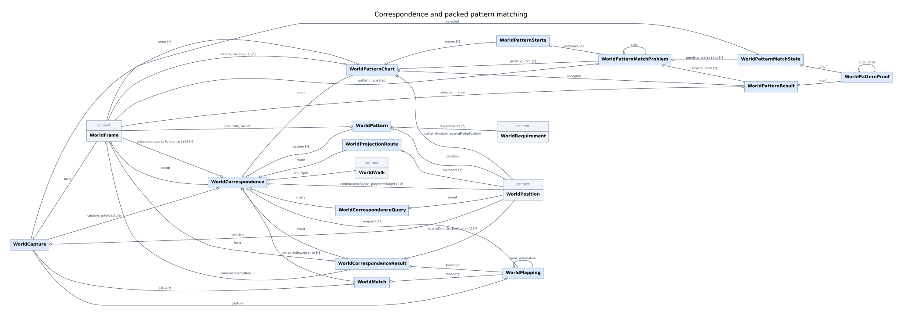

[Open scalable diagram](diagrams/proteus/11-correspondence.svg). 14 primary classes.

Context: `WorldFrame`, `WorldPosition`, `WorldWalk`, `WorldRequirement`.

Editable Mermaid source

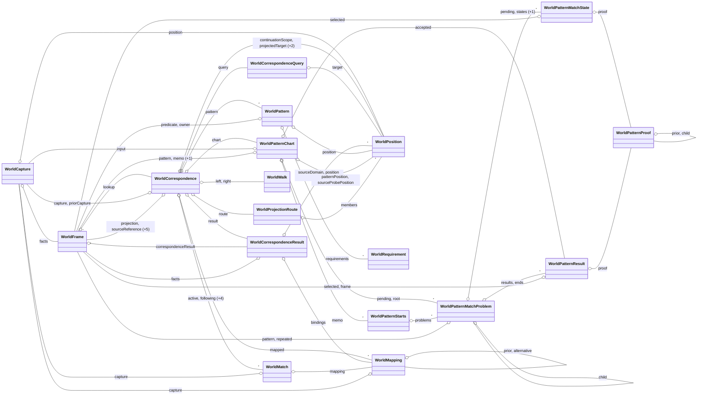
```mermaid
classDiagram
direction LR
class WorldCapture {
}
class WorldCorrespondence {
}
class WorldCorrespondenceQuery {
}
class WorldCorrespondenceResult {
}
class WorldFrame {
}
class WorldMapping {
}
class WorldMatch {
}
class WorldPattern {
}
class WorldPatternChart {
}
class WorldPatternMatchProblem {
}
class WorldPatternMatchState {
}
class WorldPatternProof {
}
class WorldPatternResult {
}
class WorldPatternStarts {
}
class WorldPosition {
}
class WorldProjectionRoute {
}
class WorldRequirement {
}
class WorldWalk {
}
WorldCapture o-- WorldFrame : facts
WorldCapture o-- WorldPosition : position
WorldCorrespondence o-- WorldCapture : capture, priorCapture
WorldCorrespondence o-- WorldCorrespondenceQuery : query
WorldCorrespondence o-- WorldCorrespondenceResult : result
WorldCorrespondence o-- "*" WorldFrame : projection, sourceReference (+5)
WorldCorrespondence o-- "*" WorldMapping : mapped
WorldCorrespondence o-- "*" WorldMatch : active, following (+4)
WorldCorrespondence o-- "*" WorldPattern : pattern
WorldCorrespondence o-- WorldPatternChart : chart
WorldCorrespondence o-- WorldPosition : continuationScope, projectedTarget (+2)
WorldCorrespondence o-- WorldProjectionRoute : route
WorldCorrespondence o-- WorldWalk : left, right
WorldCorrespondenceQuery o-- WorldPosition : target
WorldCorrespondenceResult o-- WorldFrame : facts
WorldCorrespondenceResult o-- WorldMapping : bindings
WorldCorrespondenceResult o-- "*" WorldPosition : sourceDomain, position (+1)
WorldFrame o-- WorldCorrespondence : lookup
WorldFrame o-- WorldCorrespondenceResult : correspondenceResult
WorldMapping o-- WorldCapture : capture
WorldMapping o-- WorldMapping : prior, alternative
WorldMatch o-- WorldCapture : capture
WorldMatch o-- WorldMapping : mapping
WorldPattern o-- WorldFrame : predicate, owner
WorldPattern o-- WorldPosition : position
WorldPattern o-- "*" WorldRequirement : requirements
WorldPatternChart o-- "*" WorldCapture : input
WorldPatternChart o-- "*" WorldFrame : pattern, memo (+1)
WorldPatternChart o-- "*" WorldPatternMatchProblem : pending, root
WorldPatternChart o-- WorldPatternResult : accepted
WorldPatternChart o-- "*" WorldPatternStarts : memo
WorldPatternChart o-- WorldPosition : patternPosition, sourceProbePosition
WorldPatternMatchProblem o-- WorldFrame : pattern, repeated
WorldPatternMatchProblem o-- WorldPatternMatchProblem : child
WorldPatternMatchProblem o-- "*" WorldPatternMatchState : pending, states (+1)
WorldPatternMatchProblem o-- "*" WorldPatternResult : results, ends
WorldPatternMatchState o-- WorldFrame : selected
WorldPatternMatchState o-- WorldPatternProof : proof
WorldPatternProof o-- WorldPatternProof : prior, child
WorldPatternResult o-- WorldFrame : selected, frame
WorldPatternResult o-- WorldPatternProof : proof
WorldPatternStarts o-- "*" WorldPatternMatchProblem : problems
WorldProjectionRoute o-- "*" WorldPosition : members
```

## Path evaluation, unit coordinates and sparse edits

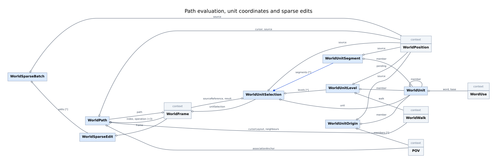

[Open scalable diagram](diagrams/proteus/12-unit-paths.svg). 8 primary classes.

Context: `WorldPosition`, `WorldFrame`, `WorldWalk`, `WordUse`, `POV`.

Editable Mermaid source

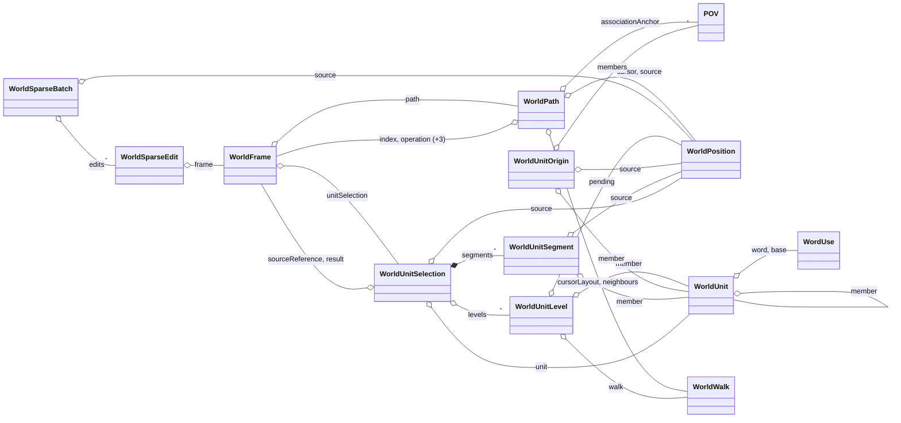
```mermaid
classDiagram
direction LR
class POV {
}
class WordUse {
}
class WorldFrame {
}
class WorldPath {
}
class WorldPosition {
}
class WorldSparseBatch {
}
class WorldSparseEdit {
}
class WorldUnit {
}
class WorldUnitLevel {
}
class WorldUnitOrigin {
}
class WorldUnitSegment {
}
class WorldUnitSelection {
}
class WorldWalk {
}
WorldFrame o-- WorldPath : path
WorldFrame o-- WorldUnitSelection : unitSelection
WorldPath o-- POV : associationAnchor
WorldPath o-- WorldFrame : index, operation (+3)
WorldPath o-- WorldPosition : cursor, source
WorldPath o-- WorldWalk : cursorLayout, neighbours
WorldSparseBatch o-- WorldPosition : source
WorldSparseBatch o-- "*" WorldSparseEdit : edits
WorldSparseEdit o-- WorldFrame : frame
WorldUnit o-- WordUse : word, base
WorldUnit o-- WorldUnit : member
WorldUnitLevel o-- WorldPosition : pending
WorldUnitLevel o-- WorldUnit : member
WorldUnitLevel o-- WorldWalk : walk
WorldUnitOrigin o-- "*" POV : members
WorldUnitOrigin o-- WorldPosition : source
WorldUnitOrigin o-- WorldUnit : member
WorldUnitSegment o-- WorldPosition : source
WorldUnitSegment o-- WorldUnit : member
WorldUnitSelection o-- WorldFrame : sourceReference, result
WorldUnitSelection o-- WorldPosition : source
WorldUnitSelection o-- WorldUnit : unit
WorldUnitSelection o-- "*" WorldUnitLevel : levels
WorldUnitSelection *-- "*" WorldUnitSegment : segments
```

## Demands, cursors and retention

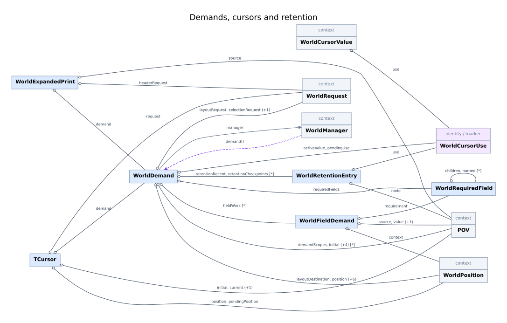

[Open scalable diagram](diagrams/proteus/13-demands.svg). 7 primary classes.

Context: `WorldManager`, `WorldRequest`, `WorldPosition`, `POV`, `WorldCursorValue`.

Editable Mermaid source

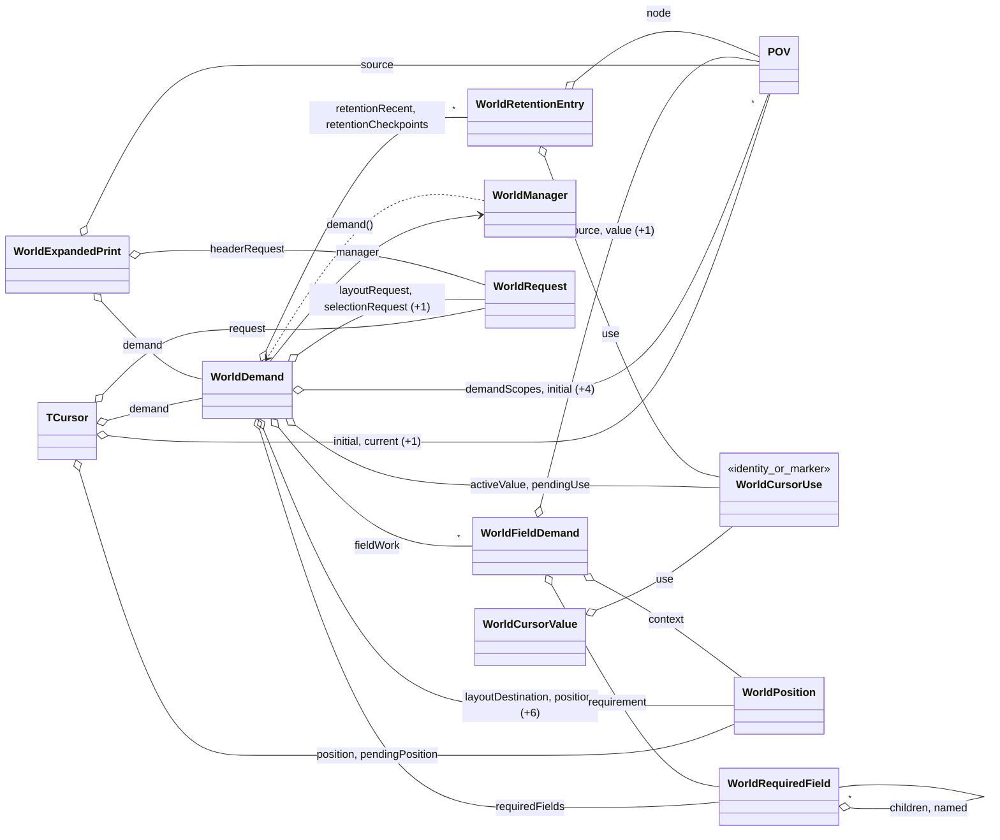
```mermaid
classDiagram
direction LR
class POV {
}
class TCursor {
}
class WorldCursorUse {
    <<identity_or_marker>>
}
class WorldCursorValue {
}
class WorldDemand {
}
class WorldExpandedPrint {
}
class WorldFieldDemand {
}
class WorldManager {
}
class WorldPosition {
}
class WorldRequest {
}
class WorldRequiredField {
}
class WorldRetentionEntry {
}
TCursor o-- POV : initial, current (+1)
TCursor o-- WorldDemand : demand
TCursor o-- WorldPosition : position, pendingPosition
TCursor o-- WorldRequest : request
WorldCursorValue o-- WorldCursorUse : use
WorldDemand o-- "*" POV : demandScopes, initial (+4)
WorldDemand o-- WorldCursorUse : activeValue, pendingUse
WorldDemand o-- "*" WorldFieldDemand : fieldWork
WorldDemand --> WorldManager : manager
WorldDemand o-- WorldPosition : layoutDestination, position (+6)
WorldDemand o-- WorldRequest : layoutRequest, selectionRequest (+1)
WorldDemand o-- WorldRequiredField : requiredFields
WorldDemand o-- "*" WorldRetentionEntry : retentionRecent, retentionCheckpoints
WorldExpandedPrint o-- POV : source
WorldExpandedPrint o-- WorldDemand : demand
WorldExpandedPrint o-- WorldRequest : headerRequest
WorldFieldDemand o-- POV : source, value (+1)
WorldFieldDemand o-- WorldPosition : context
WorldFieldDemand o-- WorldRequiredField : requirement
WorldRequiredField o-- "*" WorldRequiredField : children, named
WorldRetentionEntry o-- POV : node
WorldRetentionEntry o-- WorldCursorUse : use
WorldManager ..> WorldDemand : demand()
```

## Acquired values and cache evidence

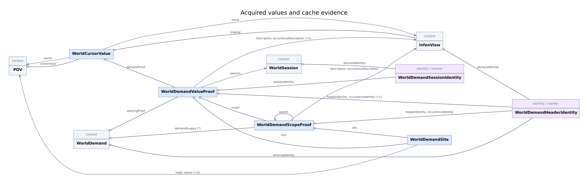

[Open scalable diagram](diagrams/proteus/13-cache-evidence.svg). 6 primary classes.

Context: `WorldDemand`, `WorldSession`, `POV`, `infonView`.

Editable Mermaid source

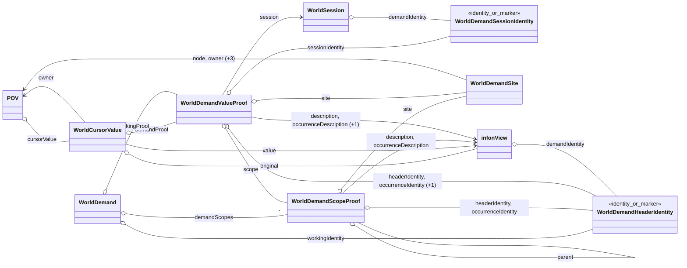
```mermaid
classDiagram
direction LR
class POV {
}
class WorldCursorValue {
}
class WorldDemand {
}
class WorldDemandHeaderIdentity {
    <<identity_or_marker>>
}
class WorldDemandScopeProof {
}
class WorldDemandSessionIdentity {
    <<identity_or_marker>>
}
class WorldDemandSite {
}
class WorldDemandValueProof {
}
class WorldSession {
}
class infonView {
}
POV o-- WorldCursorValue : cursorValue
WorldCursorValue --> POV : owner
WorldCursorValue o-- WorldDemandValueProof : demandProof
WorldCursorValue o-- infonView : original
WorldCursorValue --> infonView : value
WorldDemand o-- WorldDemandHeaderIdentity : workingIdentity
WorldDemand o-- "*" WorldDemandScopeProof : demandScopes
WorldDemand o-- WorldDemandValueProof : workingProof
WorldDemandScopeProof o-- WorldDemandHeaderIdentity : headerIdentity, occurrenceIdentity
WorldDemandScopeProof o-- WorldDemandScopeProof : parent
WorldDemandScopeProof o-- WorldDemandSite : site
WorldDemandScopeProof --> infonView : description, occurrenceDescription
WorldDemandSite --> POV : node, owner (+3)
WorldDemandValueProof o-- WorldDemandHeaderIdentity : headerIdentity, occurrenceIdentity (+1)
WorldDemandValueProof o-- WorldDemandScopeProof : scope
WorldDemandValueProof o-- WorldDemandSessionIdentity : sessionIdentity
WorldDemandValueProof o-- WorldDemandSite : site
WorldDemandValueProof --> WorldSession : session
WorldDemandValueProof --> infonView : description, occurrenceDescription (+1)
WorldSession o-- WorldDemandSessionIdentity : demandIdentity
infonView o-- WorldDemandHeaderIdentity : demandIdentity
```

## Generated occurrence addresses and durable writes

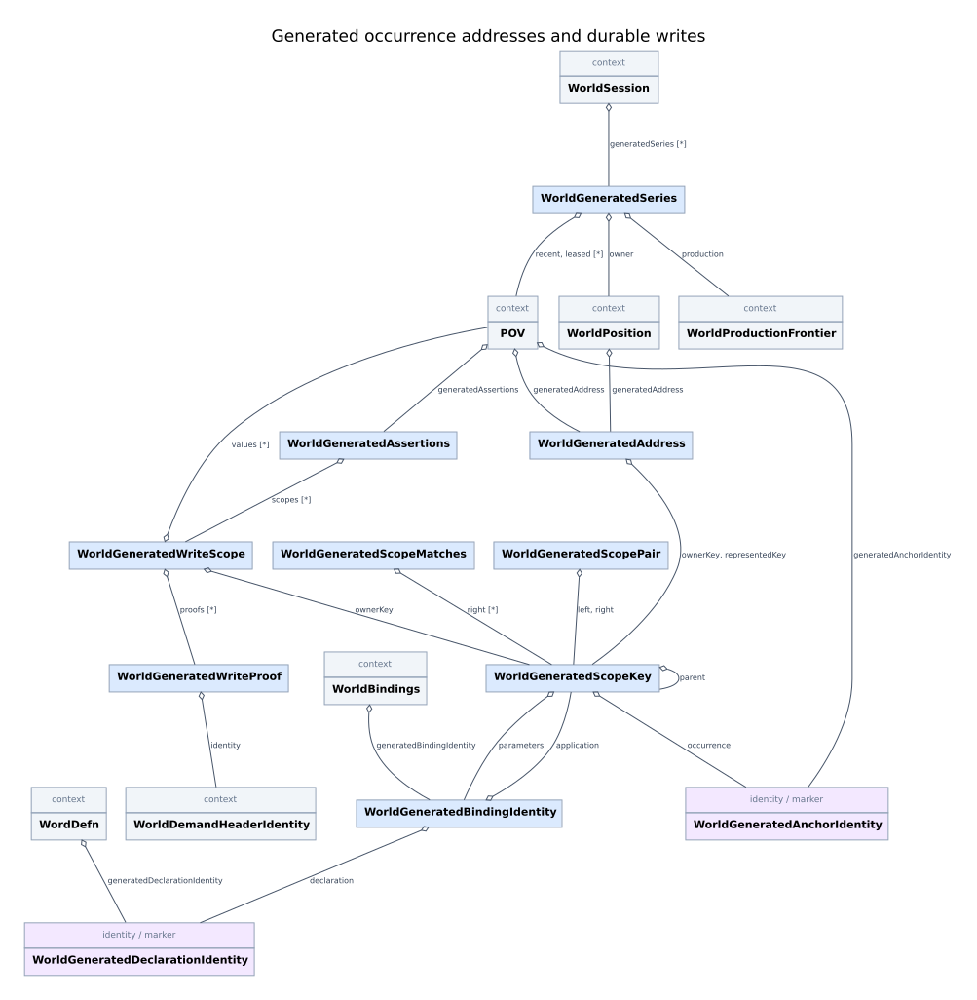

[Open scalable diagram](diagrams/proteus/14-generated.svg). 11 primary classes.

Context: `POV`, `WorldBindings`, `WordDefn`, `WorldPosition`, `WorldSession`, `WorldDemandHeaderIdentity`, `WorldProductionFrontier`.

Editable Mermaid source

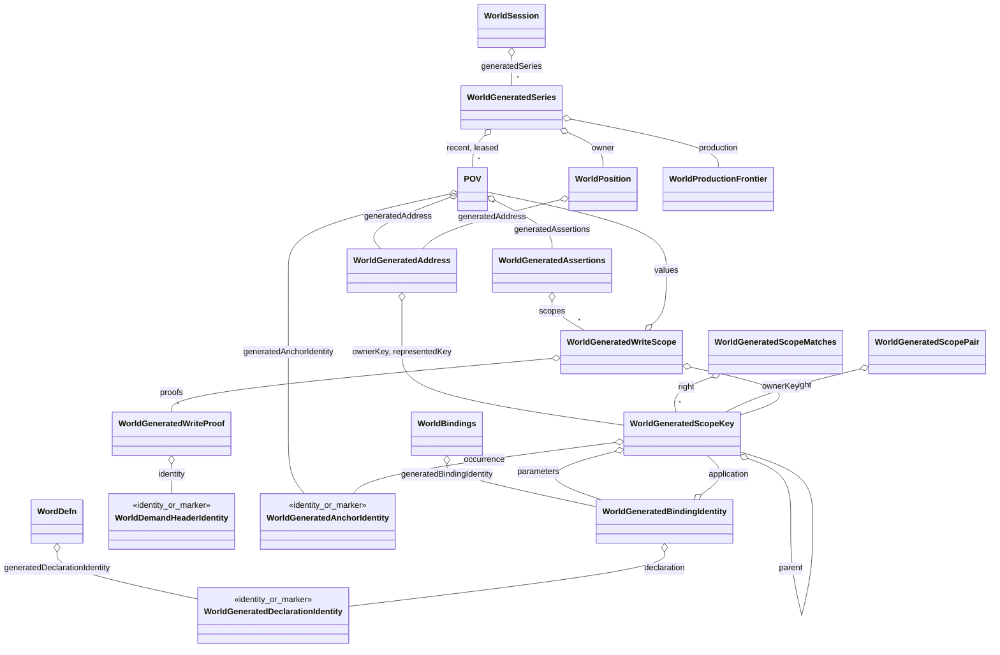
```mermaid
classDiagram
direction TB
class POV {
}
class WordDefn {
}
class WorldBindings {
}
class WorldDemandHeaderIdentity {
    <<identity_or_marker>>
}
class WorldGeneratedAddress {
}
class WorldGeneratedAnchorIdentity {
    <<identity_or_marker>>
}
class WorldGeneratedAssertions {
}
class WorldGeneratedBindingIdentity {
}
class WorldGeneratedDeclarationIdentity {
    <<identity_or_marker>>
}
class WorldGeneratedScopeKey {
}
class WorldGeneratedScopeMatches {
}
class WorldGeneratedScopePair {
}
class WorldGeneratedSeries {
}
class WorldGeneratedWriteProof {
}
class WorldGeneratedWriteScope {
}
class WorldPosition {
}
class WorldProductionFrontier {
}
class WorldSession {
}
POV o-- WorldGeneratedAddress : generatedAddress
POV o-- WorldGeneratedAnchorIdentity : generatedAnchorIdentity
POV o-- WorldGeneratedAssertions : generatedAssertions
WordDefn o-- WorldGeneratedDeclarationIdentity : generatedDeclarationIdentity
WorldBindings o-- WorldGeneratedBindingIdentity : generatedBindingIdentity
WorldGeneratedAddress o-- WorldGeneratedScopeKey : ownerKey, representedKey
WorldGeneratedAssertions o-- "*" WorldGeneratedWriteScope : scopes
WorldGeneratedBindingIdentity o-- WorldGeneratedDeclarationIdentity : declaration
WorldGeneratedBindingIdentity o-- WorldGeneratedScopeKey : application
WorldGeneratedScopeKey o-- WorldGeneratedAnchorIdentity : occurrence
WorldGeneratedScopeKey o-- WorldGeneratedBindingIdentity : parameters
WorldGeneratedScopeKey o-- WorldGeneratedScopeKey : parent
WorldGeneratedScopeMatches o-- "*" WorldGeneratedScopeKey : right
WorldGeneratedScopePair o-- WorldGeneratedScopeKey : left, right
WorldGeneratedSeries o-- "*" POV : recent, leased
WorldGeneratedSeries o-- WorldPosition : owner
WorldGeneratedSeries o-- WorldProductionFrontier : production
WorldGeneratedWriteProof o-- WorldDemandHeaderIdentity : identity
WorldGeneratedWriteScope o-- "*" POV : values
WorldGeneratedWriteScope o-- WorldGeneratedScopeKey : ownerKey
WorldGeneratedWriteScope o-- "*" WorldGeneratedWriteProof : proofs
WorldPosition o-- WorldGeneratedAddress : generatedAddress
WorldSession o-- "*" WorldGeneratedSeries : generatedSeries
```

## Production programs, dependencies and replay

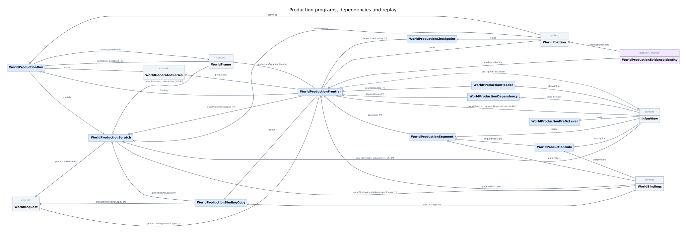

[Open scalable diagram](diagrams/proteus/15-production.svg). 11 primary classes.

Context: `WorldRequest`, `WorldFrame`, `WorldPosition`, `WorldBindings`, `WorldGeneratedSeries`, `infonView`.

Editable Mermaid source

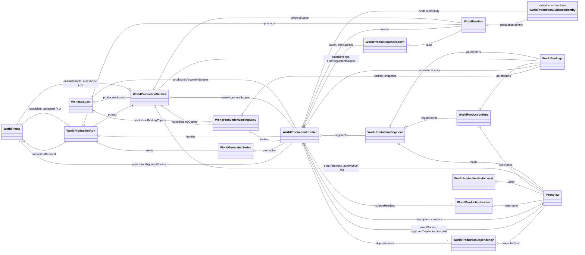
```mermaid
classDiagram
direction LR
class WorldBindings {
}
class WorldFrame {
}
class WorldGeneratedSeries {
}
class WorldPosition {
}
class WorldProductionBindingCopy {
}
class WorldProductionCheckpoint {
}
class WorldProductionDependency {
}
class WorldProductionEvidenceIdentity {
    <<identity_or_marker>>
}
class WorldProductionFrontier {
}
class WorldProductionHeader {
}
class WorldProductionPrefixLevel {
}
class WorldProductionRule {
}
class WorldProductionRun {
}
class WorldProductionScratch {
}
class WorldProductionSegment {
}
class WorldRequest {
}
class infonView {
}
WorldFrame o-- WorldProductionFrontier : productionArgumentFrontier
WorldFrame o-- WorldProductionRun : productionDemand
WorldGeneratedSeries o-- WorldProductionFrontier : production
WorldPosition o-- WorldProductionEvidenceIdentity : productionIdentity
WorldProductionBindingCopy o-- WorldBindings : source, snapshot
WorldProductionBindingCopy o-- WorldProductionFrontier : frontier
WorldProductionCheckpoint o-- WorldPosition : value
WorldProductionDependency o-- infonView : view, listSpec
WorldProductionFrontier o-- "*" WorldBindings : parameterScopes
WorldProductionFrontier o-- WorldPosition : owner
WorldProductionFrontier o-- "*" WorldProductionCheckpoint : latest, checkpoints
WorldProductionFrontier o-- "*" WorldProductionDependency : dependencies
WorldProductionFrontier o-- WorldProductionEvidenceIdentity : evidenceIdentity
WorldProductionFrontier o-- "*" WorldProductionHeader : sourceHeaders
WorldProductionFrontier o-- "*" WorldProductionSegment : segments
WorldProductionFrontier o-- "*" infonView : worldSource, capturedDependencies (+4)
WorldProductionFrontier --> infonView : description, structure
WorldProductionHeader o-- infonView : description
WorldProductionPrefixLevel o-- infonView : body
WorldProductionRule o-- WorldBindings : parameters
WorldProductionRule o-- infonView : description
WorldProductionRun o-- WorldFrame : candidate, accepted (+1)
WorldProductionRun o-- WorldGeneratedSeries : series
WorldProductionRun o-- WorldPosition : previous
WorldProductionRun o-- WorldProductionFrontier : frontier
WorldProductionRun --> WorldProductionScratch : scratch
WorldProductionScratch o-- "*" WorldBindings : outerBindings, outerArgumentScopes
WorldProductionScratch o-- "*" WorldFrame : outerAttempts, outerActive (+3)
WorldProductionScratch o-- WorldPosition : previousValue
WorldProductionScratch o-- "*" WorldProductionBindingCopy : outerBindingCopies
WorldProductionScratch o-- "*" WorldProductionFrontier : outerArgumentScopes
WorldProductionScratch o-- "*" infonView : outerAttempts, outerActive (+5)
WorldProductionSegment o-- WorldBindings : parameters
WorldProductionSegment o-- "*" WorldProductionRule : requirements
WorldProductionSegment o-- infonView : recipe
WorldRequest o-- "*" WorldProductionBindingCopy : productionBindingCopies
WorldRequest o-- "*" WorldProductionFrontier : productionArgumentScopes
WorldRequest o-- "*" WorldProductionScratch : productionScratch
```

## Layout proofs and private checked/produced views

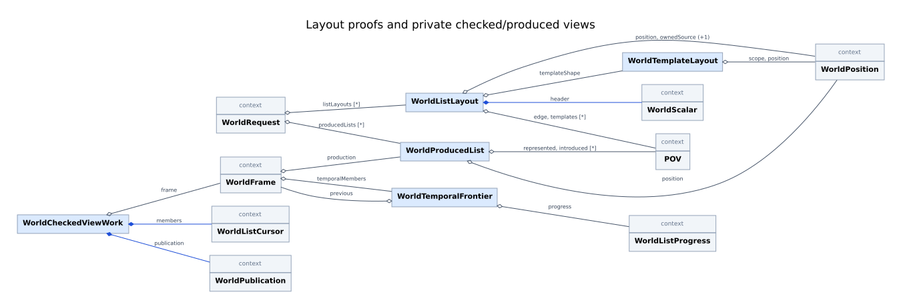

[Open scalable diagram](diagrams/proteus/16-layout-views.svg). 5 primary classes.

Context: `WorldRequest`, `WorldFrame`, `WorldPosition`, `WorldScalar`, `WorldListProgress`, `WorldPublication`, `WorldListCursor`, `POV`.

Editable Mermaid source

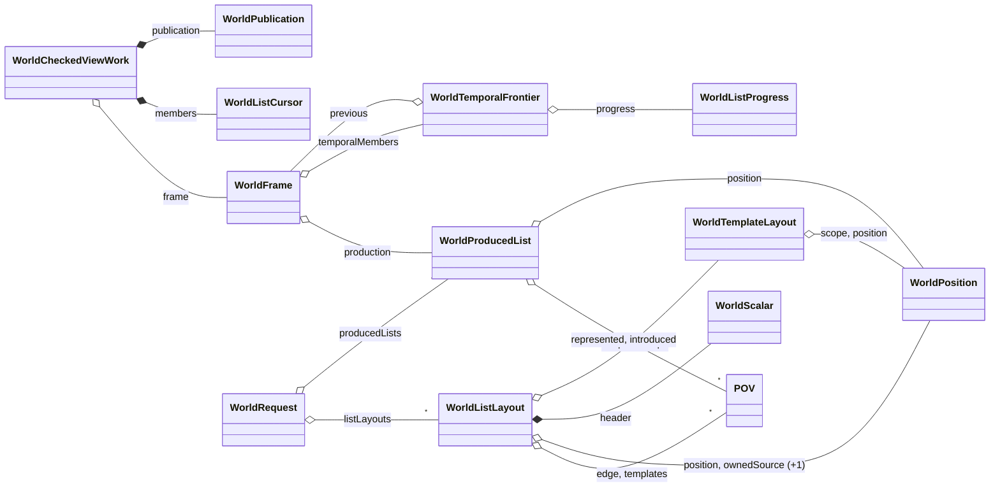
```mermaid
classDiagram
direction LR
class POV {
}
class WorldCheckedViewWork {
}
class WorldFrame {
}
class WorldListCursor {
}
class WorldListLayout {
}
class WorldListProgress {
}
class WorldPosition {
}
class WorldProducedList {
}
class WorldPublication {
}
class WorldRequest {
}
class WorldScalar {
}
class WorldTemplateLayout {
}
class WorldTemporalFrontier {
}
WorldCheckedViewWork o-- WorldFrame : frame
WorldCheckedViewWork *-- WorldListCursor : members
WorldCheckedViewWork *-- WorldPublication : publication
WorldFrame o-- WorldProducedList : production
WorldFrame o-- WorldTemporalFrontier : temporalMembers
WorldListLayout o-- "*" POV : edge, templates
WorldListLayout o-- WorldPosition : position, ownedSource (+1)
WorldListLayout *-- WorldScalar : header
WorldListLayout o-- WorldTemplateLayout : templateShape
WorldProducedList o-- "*" POV : represented, introduced
WorldProducedList o-- WorldPosition : position
WorldRequest o-- "*" WorldListLayout : listLayouts
WorldRequest o-- "*" WorldProducedList : producedLists
WorldTemplateLayout o-- WorldPosition : scope, position
WorldTemporalFrontier o-- WorldFrame : previous
WorldTemporalFrontier o-- WorldListProgress : progress
```

## Shared text expressions and traversal

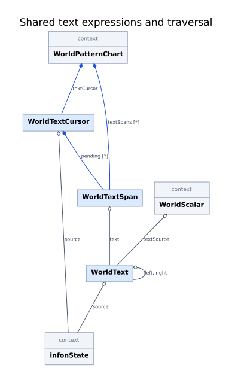

[Open scalable diagram](diagrams/proteus/18-shared-text.svg). 3 primary classes.

Context: `WorldScalar`, `WorldPatternChart`, `infonState`.

Editable Mermaid source

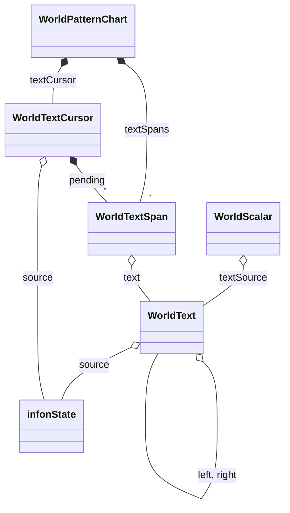
```mermaid
classDiagram
direction TB
class WorldPatternChart {
}
class WorldScalar {
}
class WorldText {
}
class WorldTextCursor {
}
class WorldTextSpan {
}
class infonState {
}
WorldPatternChart *-- WorldTextCursor : textCursor
WorldPatternChart *-- "*" WorldTextSpan : textSpans
WorldScalar o-- WorldText : textSource
WorldText o-- WorldText : left, right
WorldText o-- infonState : source
WorldTextCursor *-- "*" WorldTextSpan : pending
WorldTextCursor o-- infonState : source
WorldTextSpan o-- WorldText : text
```

## Global services and native lifetime bindings

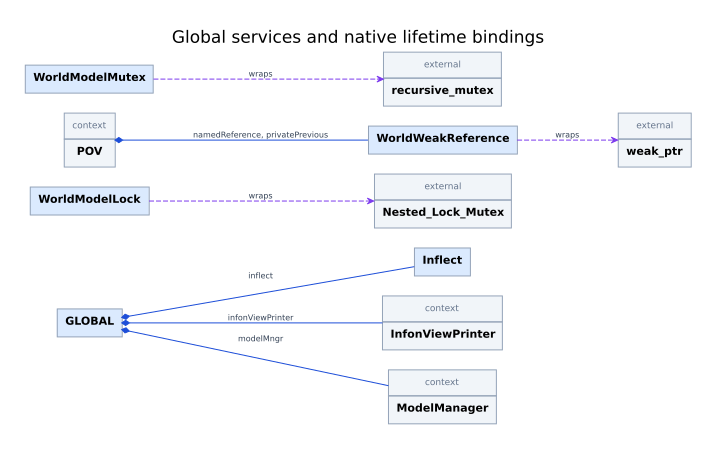

[Open scalable diagram](diagrams/proteus/17-global-native.svg). 5 primary classes.

Context: `ModelManager`, `InfonViewPrinter`, `POV`.

Editable Mermaid source

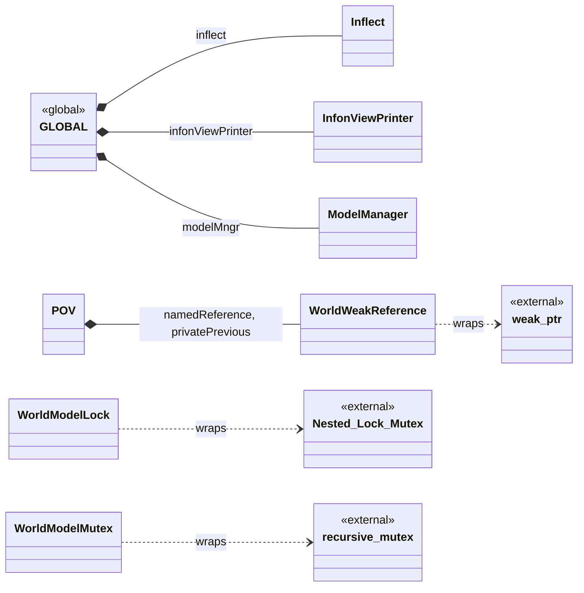
```mermaid
classDiagram
direction LR
class GLOBAL {
    <<global>>
}
class Inflect {
}
class InfonViewPrinter {
}
class ModelManager {
}
class POV {
}
class WorldModelLock {
}
class WorldModelMutex {
}
class WorldWeakReference {
}
class Nested_Lock_Mutex {
    <<external>>
}
class recursive_mutex {
    <<external>>
}
class weak_ptr {
    <<external>>
}
GLOBAL *-- Inflect : inflect
GLOBAL *-- InfonViewPrinter : infonViewPrinter
GLOBAL *-- ModelManager : modelMngr
POV *-- WorldWeakReference : namedReference, privatePrevious
WorldModelLock ..> Nested_Lock_Mutex : wraps
WorldModelMutex ..> recursive_mutex : wraps
WorldWeakReference ..> weak_ptr : wraps
```

## Class coverage index

Every class from the reference has one primary subsystem below.

| Class | Primary view |
|---|---|
| `Agent` | [Host, sessions and request handles](#01-host-sessions) |
| `AgentContext` | [Host, sessions and request handles](#01-host-sessions) |
| `AssetFileConnector` | [Parsing, formatting and stream workers](#08-streams-parser) |
| `BoundaryReference` | [Occurrence provenance and identity tokens](#03-provenance) |
| `EndRelativeExtentResult` | [Identity registry, repetition and end-relative access](#04-identity-registry) |
| `EndRelativeExtentStatus` | [Identity registry, repetition and end-relative access](#04-identity-registry) |
| `EndRelativeReference` | [Identity registry, repetition and end-relative access](#04-identity-registry) |
| `EndRelativeWindowAvailability` | [Identity registry, repetition and end-relative access](#04-identity-registry) |
| `EndRelativeWindowContentStatus` | [Identity registry, repetition and end-relative access](#04-identity-registry) |
| `ExternalAssociationReference` | [Selection and temporal relationship records](#05-selection-time) |
| `GLOBAL` | [Global services and native lifetime bindings](#17-global-native) |
| `IdentityEvidenceKind` | [Identity registry, repetition and end-relative access](#04-identity-registry) |
| `IdentityRegistry` | [Identity registry, repetition and end-relative access](#04-identity-registry) |
| `IdentityRelation` | [Identity registry, repetition and end-relative access](#04-identity-registry) |
| `ImplicitItemMap` | [Occurrence provenance and identity tokens](#03-provenance) |
| `infItr` | [Infon model and list storage](#02-model-storage) |
| `Inflect` | [Global services and native lifetime bindings](#17-global-native) |
| `InfonConnector` | [Parsing, formatting and stream workers](#08-streams-parser) |
| `InfonIdentity` | [Occurrence provenance and identity tokens](#03-provenance) |
| `InfonIdentityScope` | [Occurrence provenance and identity tokens](#03-provenance) |
| `InfonPrintMode` | [Parsing, formatting and stream workers](#08-streams-parser) |
| `infonState` | [Infon model and list storage](#02-model-storage) |
| `InfonStream` | [Parsing, formatting and stream workers](#08-streams-parser) |
| `InfonStreamLoader` | [Parsing, formatting and stream workers](#08-streams-parser) |
| `InfonStreamSpec` | [Parsing, formatting and stream workers](#08-streams-parser) |
| `infonView` | [Infon model and list storage](#02-model-storage) |
| `InfonViewPrinter` | [Parsing, formatting and stream workers](#08-streams-parser) |
| `ModelManager` | [Vocabulary, lexical scopes and unit descriptions](#06-vocabulary) |
| `OrderedSpanConverter` | [Vocabulary, lexical scopes and unit descriptions](#06-vocabulary) |
| `OrderedSpanMeasure` | [Vocabulary, lexical scopes and unit descriptions](#06-vocabulary) |
| `OrderedSpanTraversalWindow` | [Vocabulary, lexical scopes and unit descriptions](#06-vocabulary) |
| `OrderMode` | [Infon model and list storage](#02-model-storage) |
| `parseContext` | [Parsing, formatting and stream workers](#08-streams-parser) |
| `PartPath` | [Infon model and list storage](#02-model-storage) |
| `POV` | [Infon model and list storage](#02-model-storage) |
| `PovList` | [Infon model and list storage](#02-model-storage) |
| `POVPedigree` | [Infon model and list storage](#02-model-storage) |
| `ppStatus` | [Parsing, formatting and stream workers](#08-streams-parser) |
| `ProteusCore` | [Host, sessions and request handles](#01-host-sessions) |
| `ProteusParser` | [Parsing, formatting and stream workers](#08-streams-parser) |
| `ReferenceAliasViewMap` | [Occurrence provenance and identity tokens](#03-provenance) |
| `RepetitionFamily` | [Identity registry, repetition and end-relative access](#04-identity-registry) |
| `RepetitionOccurrence` | [Identity registry, repetition and end-relative access](#04-identity-registry) |
| `RepetitionSpanMap` | [Occurrence provenance and identity tokens](#03-provenance) |
| `SelectionReference` | [Selection and temporal relationship records](#05-selection-time) |
| `SelectionReferenceKind` | [Selection and temporal relationship records](#05-selection-time) |
| `SelectionRequest` | [Selection and temporal relationship records](#05-selection-time) |
| `SelectionResolution` | [Selection and temporal relationship records](#05-selection-time) |
| `SelectionResolutionState` | [Selection and temporal relationship records](#05-selection-time) |
| `SizeMode` | [Infon model and list storage](#02-model-storage) |
| `TCursor` | [Demands, cursors and retention](#13-demands) |
| `TemporalBoundaryIdentity` | [Selection and temporal relationship records](#05-selection-time) |
| `TemporalBoundaryViewMap` | [Occurrence provenance and identity tokens](#03-provenance) |
| `TemporalContainmentIdentity` | [Selection and temporal relationship records](#05-selection-time) |
| `TemporalProjectionReference` | [Selection and temporal relationship records](#05-selection-time) |
| `TemporalProjectionViewMap` | [Occurrence provenance and identity tokens](#03-provenance) |
| `TemporalRootingReference` | [Selection and temporal relationship records](#05-selection-time) |
| `TemporalSplitReference` | [Selection and temporal relationship records](#05-selection-time) |
| `TemporalSplitViewMap` | [Occurrence provenance and identity tokens](#03-provenance) |
| `ThreadedInfonParser` | [Parsing, formatting and stream workers](#08-streams-parser) |
| `ThreadedNormalizer` | [Parsing, formatting and stream workers](#08-streams-parser) |
| `ThreadedStreamInput` | [Parsing, formatting and stream workers](#08-streams-parser) |
| `ThreadedStreamOpen` | [Parsing, formatting and stream workers](#08-streams-parser) |
| `ViewMap` | [Occurrence provenance and identity tokens](#03-provenance) |
| `vocabularySpec` | [Vocabulary, lexical scopes and unit descriptions](#06-vocabulary) |
| `WordArgument` | [Vocabulary, lexical scopes and unit descriptions](#06-vocabulary) |
| `WordArguments` | [Vocabulary, lexical scopes and unit descriptions](#06-vocabulary) |
| `WordDefn` | [Vocabulary, lexical scopes and unit descriptions](#06-vocabulary) |
| `WordResolutionAxis` | [Word-resolution policy records](#07-word-rules) |
| `WordResolutionBranch` | [Word-resolution policy records](#07-word-rules) |
| `WordResolutionCandidate` | [Word-resolution policy records](#07-word-rules) |
| `WordResolutionCostEstimate` | [Word-resolution policy records](#07-word-rules) |
| `WordResolutionCostModel` | [Word-resolution policy records](#07-word-rules) |
| `WordResolutionPlan` | [Word-resolution policy records](#07-word-rules) |
| `WordResolutionState` | [Word-resolution policy records](#07-word-rules) |
| `WordResolutionTier` | [Word-resolution policy records](#07-word-rules) |
| `WordRulePlanner` | [Word-resolution policy records](#07-word-rules) |
| `WordScope` | [Vocabulary, lexical scopes and unit descriptions](#06-vocabulary) |
| `WordScopeDeclarations` | [Vocabulary, lexical scopes and unit descriptions](#06-vocabulary) |
| `WordScopePath` | [Vocabulary, lexical scopes and unit descriptions](#06-vocabulary) |
| `WordUse` | [Vocabulary, lexical scopes and unit descriptions](#06-vocabulary) |
| `WorldAlternatives` | [Frames, checked facts, parameters and publication](#09-frame-facts) |
| `WorldArgumentBinding` | [Frames, checked facts, parameters and publication](#09-frame-facts) |
| `WorldBindings` | [Frames, checked facts, parameters and publication](#09-frame-facts) |
| `WorldBounds` | [Frames, checked facts, parameters and publication](#09-frame-facts) |
| `WorldCapture` | [Correspondence and packed pattern matching](#11-correspondence) |
| `WorldCheckedViewWork` | [Layout proofs and private checked/produced views](#16-layout-views) |
| `WorldChoiceMerge` | [Frames, checked facts, parameters and publication](#09-frame-facts) |
| `WorldControl` | [Host, sessions and request handles](#01-host-sessions) |
| `WorldCorrespondence` | [Correspondence and packed pattern matching](#11-correspondence) |
| `WorldCorrespondenceQuery` | [Correspondence and packed pattern matching](#11-correspondence) |
| `WorldCorrespondenceResult` | [Correspondence and packed pattern matching](#11-correspondence) |
| `WorldCursorUse` | [Demands, cursors and retention](#13-demands) |
| `WorldCursorValue` | [Acquired values and cache evidence](#13-cache-evidence) |
| `WorldCursorWrite` | [Frames, checked facts, parameters and publication](#09-frame-facts) |
| `WorldDefinitions` | [Vocabulary, lexical scopes and unit descriptions](#06-vocabulary) |
| `WorldDefinitionTable` | [Vocabulary, lexical scopes and unit descriptions](#06-vocabulary) |
| `WorldDemand` | [Demands, cursors and retention](#13-demands) |
| `WorldDemandHeaderIdentity` | [Acquired values and cache evidence](#13-cache-evidence) |
| `WorldDemandScopeProof` | [Acquired values and cache evidence](#13-cache-evidence) |
| `WorldDemandSessionIdentity` | [Acquired values and cache evidence](#13-cache-evidence) |
| `WorldDemandSite` | [Acquired values and cache evidence](#13-cache-evidence) |
| `WorldDemandValueProof` | [Acquired values and cache evidence](#13-cache-evidence) |
| `WorldExpandedPrint` | [Demands, cursors and retention](#13-demands) |
| `WorldFieldDemand` | [Demands, cursors and retention](#13-demands) |
| `WorldFieldMerge` | [Logical sequences, walks and open alignment](#10-list-walks) |
| `WorldFrame` | [Frames, checked facts, parameters and publication](#09-frame-facts) |
| `WorldGeneratedAddress` | [Generated occurrence addresses and durable writes](#14-generated) |
| `WorldGeneratedAnchorIdentity` | [Generated occurrence addresses and durable writes](#14-generated) |
| `WorldGeneratedAssertions` | [Generated occurrence addresses and durable writes](#14-generated) |
| `WorldGeneratedBindingIdentity` | [Generated occurrence addresses and durable writes](#14-generated) |
| `WorldGeneratedDeclarationIdentity` | [Generated occurrence addresses and durable writes](#14-generated) |
| `WorldGeneratedScopeKey` | [Generated occurrence addresses and durable writes](#14-generated) |
| `WorldGeneratedScopeMatches` | [Generated occurrence addresses and durable writes](#14-generated) |
| `WorldGeneratedScopePair` | [Generated occurrence addresses and durable writes](#14-generated) |
| `WorldGeneratedSeries` | [Generated occurrence addresses and durable writes](#14-generated) |
| `WorldGeneratedWriteProof` | [Generated occurrence addresses and durable writes](#14-generated) |
| `WorldGeneratedWriteScope` | [Generated occurrence addresses and durable writes](#14-generated) |
| `WorldInputWaiters` | [Host, sessions and request handles](#01-host-sessions) |
| `WorldList` | [Logical sequences, walks and open alignment](#10-list-walks) |
| `WorldListContinuation` | [Logical sequences, walks and open alignment](#10-list-walks) |
| `WorldListCursor` | [Logical sequences, walks and open alignment](#10-list-walks) |
| `WorldListLayout` | [Layout proofs and private checked/produced views](#16-layout-views) |
| `WorldListPosition` | [Logical sequences, walks and open alignment](#10-list-walks) |
| `WorldListProgress` | [Logical sequences, walks and open alignment](#10-list-walks) |
| `WorldManager` | [Host, sessions and request handles](#01-host-sessions) |
| `WorldMapping` | [Correspondence and packed pattern matching](#11-correspondence) |
| `WorldMatch` | [Correspondence and packed pattern matching](#11-correspondence) |
| `WorldMember` | [Logical sequences, walks and open alignment](#10-list-walks) |
| `WorldModelLock` | [Global services and native lifetime bindings](#17-global-native) |
| `WorldModelMutex` | [Global services and native lifetime bindings](#17-global-native) |
| `WorldNameBinding` | [Vocabulary, lexical scopes and unit descriptions](#06-vocabulary) |
| `WorldOpenAlignment` | [Logical sequences, walks and open alignment](#10-list-walks) |
| `WorldOpenLayout` | [Logical sequences, walks and open alignment](#10-list-walks) |
| `WorldOpenScan` | [Logical sequences, walks and open alignment](#10-list-walks) |
| `WorldOrderedLayoutProof` | [Logical sequences, walks and open alignment](#10-list-walks) |
| `WorldOutcome` | [Host, sessions and request handles](#01-host-sessions) |
| `WorldParseResult` | [Host, sessions and request handles](#01-host-sessions) |
| `WorldPath` | [Path evaluation, unit coordinates and sparse edits](#12-unit-paths) |
| `WorldPattern` | [Correspondence and packed pattern matching](#11-correspondence) |
| `WorldPatternChart` | [Correspondence and packed pattern matching](#11-correspondence) |
| `WorldPatternMatchProblem` | [Correspondence and packed pattern matching](#11-correspondence) |
| `WorldPatternMatchState` | [Correspondence and packed pattern matching](#11-correspondence) |
| `WorldPatternProof` | [Correspondence and packed pattern matching](#11-correspondence) |
| `WorldPatternResult` | [Correspondence and packed pattern matching](#11-correspondence) |
| `WorldPatternStarts` | [Correspondence and packed pattern matching](#11-correspondence) |
| `WorldPosition` | [Frames, checked facts, parameters and publication](#09-frame-facts) |
| `WorldPOVGraph` | [Host, sessions and request handles](#01-host-sessions) |
| `WorldProducedList` | [Layout proofs and private checked/produced views](#16-layout-views) |
| `WorldProductionBindingCopy` | [Production programs, dependencies and replay](#15-production) |
| `WorldProductionCheckpoint` | [Production programs, dependencies and replay](#15-production) |
| `WorldProductionDependency` | [Production programs, dependencies and replay](#15-production) |
| `WorldProductionEvidenceIdentity` | [Production programs, dependencies and replay](#15-production) |
| `WorldProductionFrontier` | [Production programs, dependencies and replay](#15-production) |
| `WorldProductionHeader` | [Production programs, dependencies and replay](#15-production) |
| `WorldProductionPrefixLevel` | [Production programs, dependencies and replay](#15-production) |
| `WorldProductionRule` | [Production programs, dependencies and replay](#15-production) |
| `WorldProductionRun` | [Production programs, dependencies and replay](#15-production) |
| `WorldProductionScratch` | [Production programs, dependencies and replay](#15-production) |
| `WorldProductionSegment` | [Production programs, dependencies and replay](#15-production) |
| `WorldProjectionRoute` | [Correspondence and packed pattern matching](#11-correspondence) |
| `WorldPublication` | [Frames, checked facts, parameters and publication](#09-frame-facts) |
| `WorldRequest` | [Host, sessions and request handles](#01-host-sessions) |
| `WorldRequiredField` | [Demands, cursors and retention](#13-demands) |
| `WorldRequirement` | [Frames, checked facts, parameters and publication](#09-frame-facts) |
| `WorldRequirementCursor` | [Frames, checked facts, parameters and publication](#09-frame-facts) |
| `WorldRetentionEntry` | [Demands, cursors and retention](#13-demands) |
| `WorldScalar` | [Frames, checked facts, parameters and publication](#09-frame-facts) |
| `WorldScopedDefinitions` | [Vocabulary, lexical scopes and unit descriptions](#06-vocabulary) |
| `WorldSelection` | [Logical sequences, walks and open alignment](#10-list-walks) |
| `WorldSession` | [Host, sessions and request handles](#01-host-sessions) |
| `WorldSparseBatch` | [Path evaluation, unit coordinates and sparse edits](#12-unit-paths) |
| `WorldSparseEdit` | [Path evaluation, unit coordinates and sparse edits](#12-unit-paths) |
| `WorldStatus` | [Host, sessions and request handles](#01-host-sessions) |
| `WorldTemplateLayout` | [Layout proofs and private checked/produced views](#16-layout-views) |
| `WorldTemporalFrontier` | [Layout proofs and private checked/produced views](#16-layout-views) |
| `WorldText` | [Shared text expressions and traversal](#18-shared-text) |
| `WorldTextCursor` | [Shared text expressions and traversal](#18-shared-text) |
| `WorldTextSpan` | [Shared text expressions and traversal](#18-shared-text) |
| `WorldUnit` | [Path evaluation, unit coordinates and sparse edits](#12-unit-paths) |
| `WorldUnitLevel` | [Path evaluation, unit coordinates and sparse edits](#12-unit-paths) |
| `WorldUnitOrigin` | [Path evaluation, unit coordinates and sparse edits](#12-unit-paths) |
| `WorldUnitSegment` | [Path evaluation, unit coordinates and sparse edits](#12-unit-paths) |
| `WorldUnitSelection` | [Path evaluation, unit coordinates and sparse edits](#12-unit-paths) |
| `WorldWalk` | [Logical sequences, walks and open alignment](#10-list-walks) |
| `WorldWalkLevel` | [Logical sequences, walks and open alignment](#10-list-walks) |
| `WorldWeakReference` | [Global services and native lifetime bindings](#17-global-native) |
